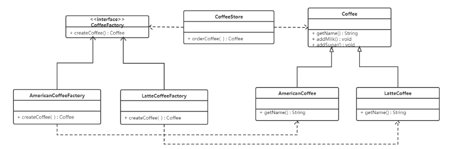
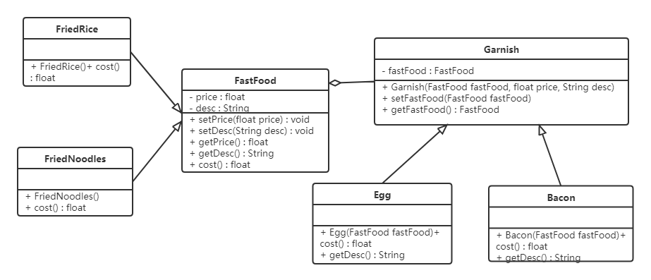
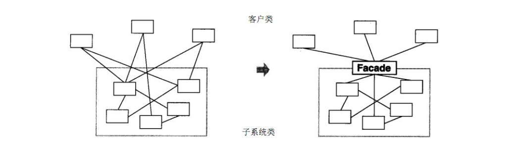
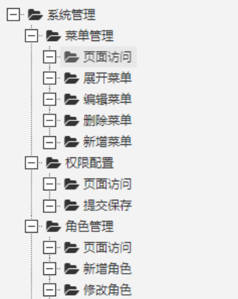

# 设计模式（JAVA）

## 第一章 软件设计的基本原则

> 学习设计模式之前有必要学习一下软件设计的基本原则，可以说各种设计模式都是这些基本原则的实践。但是这些原则并不是软件设计的铁律，但在设计时尽量去贴合这些设计原则。这里这是对这些原则的简单介绍，在具体设计模式的时候还会有专门的体现。

### 1.1 开闭原则

**对扩展开放，对修改关闭**  在程序需要进行拓展的时候，不能去修改原有的代码，实现一个热插拔的效果。简言之，是为了使程序的扩展性好，易于维护和升级。合理利用接口和抽象类，面向接口和抽象编程。因为抽象灵活性好，适应性广，只要抽象的合理，可以基本保持软件架构的稳定。而软件中易变的细节可以从抽象派生来的实现类来进行扩展，当软件需要发生变化时，只需要根据需求重新派生一个实现类来扩展就可以了。

### 1.2 里氏代换原则

任何基类可以出现的地方，子类一定可以出现。通俗理解：子类可以扩展父类的功能，但不能改变父类原有的功能。换句话说，子类继承父类时，除添加新的方法完成新增功能外，尽量不要重写父类的方法。

### 1.3 依赖倒转原则

高层模块不应该依赖低层模块，两者都应该依赖其抽象；抽象不应该依赖细节，细节应该依赖抽象。简单的说就是要求对抽象进行编程，不要对实现进行编程，这样就**降低了客户与实现模块间的耦合**。

具体请看下面这张图


### 1.4 接口隔离原则

客户端不应该被迫依赖于它不使用的方法；一个类对另一个类的依赖应该建立在最小的接口上。换句话说，就是类实现一个接口时，这个接口中不应该有这个类不需要的方法。不应该给类扩展不必要的方法，尽量细化接口。

### 1.5 迪米特法则

迪米特法则又叫最少知识原则。

只和你的直接朋友交谈，不跟“陌生人”说话（Talk only to your immediate friends and not to strangers）。

其含义是：如果两个软件实体无须直接通信，那么就不应当发生直接的相互调用，可以通过第三方转发该调用。其目的是降低类之间的耦合度，提高模块的相对独立性。

迪米特法则中的“朋友”是指：当前对象本身、当前对象的成员对象、当前对象所创建的对象、当前对象的方法参数等，这些对象同当前对象存在关联、聚合或组合关系，可以直接访问这些对象的方法。

### 1.6 合成复用原则

合成复用原则是指：尽量先使用组合或者聚合等关联关系来实现，其次才考虑使用继承关系来实现。

通常类的复用分为继承复用和合成复用两种。

继承复用虽然有简单和易实现的优点，但它也存在以下缺点：

1. 继承复用破坏了类的封装性。因为继承会将父类的实现细节暴露给子类，父类对子类是透明的，所以这种复用又称为“白箱”复用。
2. 子类与父类的耦合度高。父类的实现的任何改变都会导致子类的实现发生变化，这不利于类的扩展与维护。
3. 它限制了复用的灵活性。从父类继承而来的实现是静态的，在编译时已经定义，所以在运行时不可能发生变化。


采用组合或聚合复用时，可以将已有对象纳入新对象中，使之成为新对象的一部分，新对象可以调用已有对象的功能，它有以下优点：

1. 它维持了类的封装性。因为成分对象的内部细节是新对象看不见的，所以这种复用又称为“黑箱”复用。
2. 对象间的耦合度低。可以在类的成员位置声明抽象。
3. 复用的灵活性高。这种复用可以在运行时动态进行，新对象可以动态地引用与成分对象类型相同的对象。

以上这些设计原则可以说是设计模式的核心，很多设计模式的产生其实都是为了更好地践行这些设计原则。

## 第二章 创建型设计模式

### 2.1 单例设计模式

> 可以说单例设计模式是最简单的设计模式，但是它的简单只是实现上的简单，以及不容易与其他设计模式搞混淆。实际上它涉及到了不少细节且容易出错的地方：类加载，线程安全，指令重排序等问题

#### 2.1.1 饿汉式

饿汉式是指类加载就实例化对象，十分形象

具体实现如下：

```java
public class HungrySingleton {

    private static HungrySingleton instance = new HungrySingleton();
    /*static {
        instance = new HungrySingleton(); 静态代码块中初始化
    }*/
    private HungrySingleton() {} //构造器私有
    public static HungrySingleton getInstance() {
        return instance;
    }
}
```

优缺点很明显，实现简单，无线程安全问题，因为JVM会保证该类只被加载一次。但是类加载就实例化对象，可能会造成空间的浪费。

#### 2.1.2 懒汉式

懒汉式是指类加载不会导致该单实例对象被创建，而是首次使用该对象时才会创建

具体实现如下

**双重锁检查方式：**

```java
/**
 * 双重检查方式
 */
public class Singleton { 

    //私有构造方法
    private Singleton() {}

    private static volatile Singleton instance;//防止指令重排序

   //对外提供静态方法获取该对象
    public static Singleton getInstance() {
		//第一次判断，如果instance不为null，不进入抢锁阶段，直接返回实例
        if(instance == null) {
            synchronized (Singleton.class) {
                //抢到锁之后再次判断是否为null
                if(instance == null) {
                    instance = new Singleton();
                }
            }
        }
        return instance;
    }
}
```

双重检查锁模式是一种非常好的单例实现模式，解决了单例、性能、线程安全问题，在多线程的情况下，可能会出现空指针问题，出现问题的原因是JVM在实例化对象的时候会进行优化和指令重排序操作。

要解决双重检查锁模式带来空指针异常的问题，只需要使用 `volatile` 关键字, `volatile` 关键字可以保证可见性和有序性。

**静态内部类方式：**

```java
/**
 * 静态内部类方式
 */
public class Singleton {

    //私有构造方法
    private Singleton() {}

    private static class SingletonHolder {
        private static final Singleton INSTANCE = new Singleton();
    }

    //对外提供静态方法获取该对象
    public static Singleton getInstance() {
        return SingletonHolder.INSTANCE;
    }
}
```

静态内部类单例模式中实例由内部类创建，由于 JVM 在加载外部类的过程中, 是不会加载静态内部类的, 只有内部类的属性/方法被调用时才会被加载, 并初始化其静态属性。静态属性由于被 `static` 修饰，保证只被实例化一次，并且严格保证实例化顺序。

静态内部类单例模式是一种优秀的单例模式，是开源项目中比较常用的一种单例模式。在没有加任何锁的情况下，保证了多线程下的安全，并且没有任何性能影响和空间的浪费。

单例模式的核心思想就是保证类只有一个实例，静态变量确保了类的整个生命周期内，该变量只有一个实例存在。静态变量 `INSTANCE` 一旦被初始化，它在所有线程中共享，并且可以通过 `getInstance()` 方法访问，保证了全局唯一性。

> ```
> tips：对象的创建依赖于类的加载。换句话说，类必须已经加载到内存中，才能创建该类的对象。这意味着类加载的时机比对象创建的时机更早。当你调用 new 关键字或者通过反射机制来创建对象时，JVM 会确保类已经加载并且可以使用。加载类时，JVM 会先查找类路径，找到 .class 文件，并将其读取到内存中。类加载不等于对象创建：一个类的加载和它的对象创建是两个不同的过程。类加载发生一次，而对象创建可以发生多次。
> ```

**枚举方式**

```java
/**
 * @author liuyichen
 * @version 1.0
 * 枚举类实现单例模式是极力推荐的单例实现模式，因为枚举类型是线程安全的，并且只会装载一次，
 * 设计者充分的利用了枚举的这个特性来实现单例模式，枚举的写法非常简单，而且枚举类型是所用单例实现中唯一一种不会被破坏的单例实现模式。
 * 不过需要注意的是
 * 枚举类本身并不直接表示单例模式，尽管它在某些方面与单例模式有相似之处。枚举类的特点是它可以有多个 枚举常量，
 * 而每个常量都可以被视为枚举类的一个实例。所以，枚举类定义多个常量并不意味着它只能有一个实例。
 *不过，我们可以 用枚举类实现单例模式，并且在这个用法下，枚举类具备了 单例模式的特性：在整个系统中只会有一个实例。
 */
public enum Singleton {
    INSTANCE,
    //INSTANCE2;加上这个就不是单例模式了，但是也是唯一实例。
}
```

枚举属于饿汉式

#### 2.1.3 单例模式被破坏

**序列化与反序列化**

* **Singleton类：**

  ```java
  public class Singleton implements Serializable {
  
      //私有构造方法
      private Singleton() {}
  
      private static class SingletonHolder {
          private static final Singleton INSTANCE = new Singleton();
      }
  
      //对外提供静态方法获取该对象
      public static Singleton getInstance() {
          return SingletonHolder.INSTANCE;
      }
  }
  ```

  **Test类：**

  ```java
  public class Test {
      public static void main(String[] args) throws Exception {
          //往文件中写对象
          //writeObject2File();
          //从文件中读取对象
          Singleton s1 = readObjectFromFile();
          Singleton s2 = readObjectFromFile();
  
          //判断两个反序列化后的对象是否是同一个对象
          System.out.println(s1 == s2);
      }
  
      private static Singleton readObjectFromFile() throws Exception {
          //创建对象输入流对象
          ObjectInputStream ois = new ObjectInputStream(new FileInputStream("C:\\Users\\Think\\Desktop\\a.txt"));
          //第一个读取Singleton对象
          Singleton instance = (Singleton) ois.readObject();
  
          return instance;
      }
  
      public static void writeObject2File() throws Exception {
          //获取Singleton类的对象
          Singleton instance = Singleton.getInstance();
          //创建对象输出流
          ObjectOutputStream oos = new ObjectOutputStream(new FileOutputStream("C:\\Users\\Think\\Desktop\\a.txt"));
          //将instance对象写出到文件中
          oos.writeObject(instance);
      }
  }
  ```

  > 上面代码运行结果是`false`，表明序列化和反序列化已经破坏了单例设计模式。

  

  **反射**

  **Singleton类：**

  ```java
  public class Singleton {
  
      //私有构造方法
      private Singleton() {}
      
      private static volatile Singleton instance;
  
      //对外提供静态方法获取该对象
      public static Singleton getInstance() {
  
          if(instance != null) {
              return instance;
          }
  
          synchronized (Singleton.class) {
              if(instance != null) {
                  return instance;
              }
              instance = new Singleton();
              return instance;
          }
      }
  }
  ```

  **Test类：**

  ```java
  public class Test {
      public static void main(String[] args) throws Exception {
          //获取Singleton类的字节码对象
          Class clazz = Singleton.class;
          //获取Singleton类的私有无参构造方法对象
          Constructor constructor = clazz.getDeclaredConstructor();
          //取消访问检查
          constructor.setAccessible(true);
  
          //创建Singleton类的对象s1
          Singleton s1 = (Singleton) constructor.newInstance();
          //创建Singleton类的对象s2
          Singleton s2 = (Singleton) constructor.newInstance();
  
          //判断通过反射创建的两个Singleton对象是否是同一个对象
          System.out.println(s1 == s2);
      }
  }
  ```

  > 上面代码运行结果是`false`，表明序列化和反序列化已经破坏了单例设计模式

> <font color="red">注意：</font>枚举方式不会出现这两个问题。

**问题解决**

* 序列化、反序列方式破坏单例模式的解决方法

  在Singleton类中添加`readResolve()`方法，在反序列化时被反射调用，如果定义了这个方法，就返回这个方法的值，如果没有定义，则返回新new出来的对象。

  **Singleton类：**

  ```java
  public class Singleton implements Serializable {
  
      //私有构造方法
      private Singleton() {}
  
      private static class SingletonHolder {
          private static final Singleton INSTANCE = new Singleton();
      }
  
      //对外提供静态方法获取该对象
      public static Singleton getInstance() {
          return SingletonHolder.INSTANCE;
      }
      
      /**
       * 下面是为了解决序列化反序列化破解单例模式
       */
      private Object readResolve() {
          return SingletonHolder.INSTANCE;
      }
  }
  ```

  **源码解析：**

  ObjectInputStream类

  ```java
  public final Object readObject() throws IOException, ClassNotFoundException{
      ...
      // if nested read, passHandle contains handle of enclosing object
      int outerHandle = passHandle;
      try {
          Object obj = readObject0(false);//重点查看readObject0方法
      .....
  }
      
  private Object readObject0(boolean unshared) throws IOException {
  	...
      try {
  		switch (tc) {
  			...
  			case TC_OBJECT:
  				return checkResolve(readOrdinaryObject(unshared));//重点查看readOrdinaryObject方法
  			...
          }
      } finally {
          depth--;
          bin.setBlockDataMode(oldMode);
      }    
  }
      
  private Object readOrdinaryObject(boolean unshared) throws IOException {
  	...
  	//isInstantiable 返回true，执行 desc.newInstance()，通过反射创建新的单例类，
      obj = desc.isInstantiable() ? desc.newInstance() : null; 
      ...
      // 在Singleton类中添加 readResolve 方法后 desc.hasReadResolveMethod() 方法执行结果为true
      if (obj != null && handles.lookupException(passHandle) == null && desc.hasReadResolveMethod()) {
      	// 通过反射调用 Singleton 类中的 readResolve 方法，将返回值赋值给rep变量
      	// 这样多次调用ObjectInputStream类中的readObject方法，继而就会调用我们定义的readResolve方法，所以返回的是同一个对象。
      	Object rep = desc.invokeReadResolve(obj);
       	...
      }
      return obj;
  }
  ```

* 反射方式破解单例的解决方法

  ```java
  public class Singleton {
  
      //私有构造方法
      private Singleton() {
          /*
             反射破解单例模式需要添加的代码
          */
          if(instance != null) {
              throw new RuntimeException();
          }
      }
      
      private static volatile Singleton instance;
  
      //对外提供静态方法获取该对象
      public static Singleton getInstance() {
  
          if(instance != null) {
              return instance;
          }
  
          synchronized (Singleton.class) {
              if(instance != null) {
                  return instance;
              }
              instance = new Singleton();
              return instance;
          }
      }
  }
  ```

  <font color="red">说明:</font>

  ​	这种方式比较好理解。当通过反射方式调用构造方法进行创建创建时，直接抛异常。不运行此中操作。

### 2.2 工厂模式

> **将对象的创建过程抽象化，允许子类决定实例化的具体类**。通过这种方式，客户端不需要知道对象的创建细节，从而实现了**创建与使用的解耦**。这使得代码更加灵活、可扩展，且易于维护。
>
> 工厂模式有以下几种常见的类型：
>
> 1. **简单工厂模式**（Simple Factory）：使用一个工厂类来决定实例化哪一个产品类。属于创建型模式的基础模式，**但不是真正的设计模式。**
> 2. **工厂方法模式**（Factory Method）：定义一个用于创建对象的接口，但让子类决定实例化哪一个具体类。子类提供创建对象的具体实现。
> 3. **抽象工厂模式**（Abstract Factory）：提供一个接口，用于创建一组相关或相互依赖的对象，而无需指定它们的具体类。

#### 2.1.1 简单工厂模式

简单工厂模式并不是一种设计模式，而是一种设计习惯

简单工厂包含如下角色：

* 抽象产品 ：定义了产品的规范，描述了产品的主要特性和功能。
* 具体产品 ：实现或者继承抽象产品的子类
* 具体工厂 ：提供了创建产品的方法，调用者通过该方法来获取产品。

类图


工厂类代码如下：

```java
public class SimpleCoffeeFactory {

    public Coffee createCoffee(String type) {
        Coffee coffee = null;
        if("americano".equals(type)) {
            coffee = new AmericanoCoffee();
        } else if("latte".equals(type)) {
            coffee = new LatteCoffee();
        }
        return coffee;
    }
}
```

工厂（factory）处理创建对象的细节，一旦有了SimpleCoffeeFactory，CoffeeStore类中的orderCoffee()就变成此对象的客户，后期如果需要Coffee对象直接从工厂中获取即可。这样也就解除了和Coffee实现类的耦合，同时又产生了新的耦合，CoffeeStore对象和SimpleCoffeeFactory工厂对象的耦合，工厂对象和商品对象的耦合。

后期如果再加新品种的咖啡，我们势必要需求修改SimpleCoffeeFactory的代码，违反了开闭原则。工厂类的客户端可能有很多，比如创建美团外卖等，这样只需要修改工厂类的代码，省去其他的修改操作。

**优点：**

封装了创建对象的过程，可以通过参数直接获取对象。把对象的创建和业务逻辑层分开，这样以后就避免了修改客户代码，如果要实现新产品直接修改工厂类，而不需要在原代码中修改，这样就降低了客户代码修改的可能性，更加容易扩展。

**缺点：**

增加新产品时还是需要修改工厂类的代码，违背了“开闭原则”。

#### 2.1.2 工厂方法模式


工厂方法模式的主要角色：

* 抽象工厂（Abstract Factory）：提供了创建产品的接口，调用者通过它访问具体工厂的工厂方法来创建产品。
* 具体工厂（ConcreteFactory）：主要是实现抽象工厂中的抽象方法，完成具体产品的创建。
* 抽象产品（Product）：定义了产品的规范，描述了产品的主要特性和功能。
* 具体产品（ConcreteProduct）：实现了抽象产品角色所定义的接口，由具体工厂来创建，它同具体工厂之间一一对应。

使用工厂方法模式对上例进行改进，类图如下：




代码如下：

抽象工厂：

```java
public interface CoffeeFactory {

    Coffee createCoffee();
}
```

具体工厂：

```java
public class LatteCoffeeFactory implements CoffeeFactory {

    public Coffee createCoffee() {
        return new LatteCoffee();
    }
}

public class AmericanCoffeeFactory implements CoffeeFactory {

    public Coffee createCoffee() {
        return new AmericanCoffee();
    }
}
```

咖啡店类：

```java
public class CoffeeStore {

    private CoffeeFactory factory;

    public CoffeeStore(CoffeeFactory factory) {
        this.factory = factory;
    }

    public Coffee orderCoffee(String type) {
        Coffee coffee = factory.createCoffee();
        coffee.addMilk();
        coffee.addsugar();
        return coffee;
    }
}
```

从以上的编写的代码可以看到，要增加产品类时也要相应地增加工厂类，不需要修改工厂类的代码了，这样就解决了简单工厂模式的缺点。

工厂方法模式是简单工厂模式的进一步抽象。由于使用了多态性，工厂方法模式保持了简单工厂模式的优点，而且克服了它的缺点。

**优点：**

- 用户只需要知道具体工厂的名称就可得到所要的产品，无须知道产品的具体创建过程；
- 在系统增加新的产品时只需要添加具体产品类和对应的具体工厂类，无须对原工厂进行任何修改，满足开闭原则；

**缺点：**

* 每增加一个产品就要增加一个具体产品类和一个对应的具体工厂类，这增加了系统的复杂度。


#### 2.1.3 抽象工厂模式

> 前面介绍的工厂方法模式中考虑的是一类产品的生产，如畜牧场只养动物、电视机厂只生产电视机
>
> 这些工厂只生产同种类产品，同种类产品称为同等级产品，也就是说：工厂方法模式只考虑生产同等级的产品，但是在现实生活中许多工厂是综合型的工厂，能生产多等级（种类） 的产品，如电器厂既生产电视机又生产洗衣机或空调，大学既有软件专业又有生物专业等。
>
> 接下来要介绍的抽象工厂模式将考虑多等级产品的生产，将同一个具体工厂所生产的位于不同等级的一组产品称为一个产品族，下图所示横轴是产品等级，也就是同一类产品；纵轴是产品族，也就是同一品牌的产品，同一品牌的产品产自同一个工厂。


抽象工厂模式的主要角色如下：

* 抽象工厂（Abstract Factory）：提供了创建产品的接口，它包含**多个创建产品**的方法，可以创建多个不同等级的产品。
* 具体工厂（Concrete Factory）：主要是实现抽象工厂中的多个抽象方法，完成具体产品的创建。
* 抽象产品（Product）：定义了产品的规范，描述了产品的主要特性和功能，抽象工厂模式有多个抽象产品。
* 具体产品（ConcreteProduct）：实现了抽象产品角色所定义的接口，由具体工厂来创建，它 同具体工厂之间是**多对一**的关系。

具体代码

```java
// 抽象产品接口 - 按钮
interface Button {
    void click();
}

// 抽象产品接口 - 复选框
interface Checkbox {
    void check();
}

// 具体产品 - Windows 按钮
class WindowsButton implements Button {
    public void click() {
        System.out.println("Windows Button clicked!");
    }
}

// 具体产品 - Windows 复选框
class WindowsCheckbox implements Checkbox {
    public void check() {
        System.out.println("Windows Checkbox checked!");
    }
}

// 具体产品 - MacOS 按钮
class MacOSButton implements Button {
    public void click() {
        System.out.println("MacOS Button clicked!");
    }
}

// 具体产品 - MacOS 复选框
class MacOSCheckbox implements Checkbox {
    public void check() {
        System.out.println("MacOS Checkbox checked!");
    }
}

// 抽象工厂接口
interface GUIFactory {
    Button createButton();
    Checkbox createCheckbox();
}

// 具体工厂 - Windows GUI 工厂
class WindowsFactory implements GUIFactory {
    public Button createButton() {
        return new WindowsButton();
    }

    public Checkbox createCheckbox() {
        return new WindowsCheckbox();
    }
}

// 具体工厂 - MacOS GUI 工厂
class MacOSFactory implements GUIFactory {
    public Button createButton() {
        return new MacOSButton();
    }

    public Checkbox createCheckbox() {
        return new MacOSCheckbox();
    }
}

// 客户端代码
public class Client {
    private Button button;
    private Checkbox checkbox;

    public Client(GUIFactory factory) {
        button = factory.createButton();
        checkbox = factory.createCheckbox();
    }

    public void interact() {
        button.click();
        checkbox.check();
    }

    public static void main(String[] args) {
        // 使用 Windows GUI 工厂创建 Windows UI 控件
        GUIFactory factory = new WindowsFactory();
        Client client = new Client(factory);
        client.interact();

        // 切换到 MacOS GUI 工厂创建 MacOS UI 控件
        factory = new MacOSFactory();
        client = new Client(factory);
        client.interact();
    }
}
```

在上面的例子中，抽象工厂模式确保了 `Button` 和 `Checkbox` 是在同一产品族内的，客户端代码使用 `GUIFactory` 的接口来创建产品，而无需知道具体的 `Button` 和 `Checkbox` 的实现类。通过使用 `WindowsFactory` 或 `MacOSFactory`，可以方便地在不同操作系统环境中切换不同的控件。

**优点**

1. **易于扩展新产品族**：抽象工厂模式使得增加新的产品族变得简单。只需创建新的具体工厂类，而不必修改现有代码。
2. **确保产品的相互兼容性**：抽象工厂模式会为创建的对象提供一组标准接口，确保创建的对象在同一产品族中可以相互配合使用。
3. **解耦客户端和具体类**：客户端仅依赖于抽象工厂和产品接口，不依赖于具体类，因此可以轻松更换具体工厂，切换到不同的产品族。

**缺点**

1. **增加系统复杂性**：抽象工厂模式会增加系统的类和接口数量，需要额外定义抽象工厂接口和具体工厂类，增加了代码结构的复杂性。
2. **扩展新的产品等级结构困难**：如果需要在现有产品族中增加新产品（新的产品等级），必须修改所有工厂接口及其实现，违反了开闭原则（OCP）。

```java
抽象工厂模式适用于需要创建一组相关产品的场景，
抽象工厂模式为产品族提供了一个接口，通过具体工厂来生产不同类型的产品。
这个相比工厂方法模式的好处在于，增加一系列产品只用加一个工厂类，能够缓解类的爆炸。但是在某些情况却不符合开闭原则
即新增一个类型的产品时，比如新增平板电脑这种产品，就需要改动原有代码，工厂的抽象类需要新增方法。
这种模式相当于变相细化了产品，需要抽象的工厂提供更细化的方法,抽象工厂模式有多个抽象产品
```


#### 2.1.4 扩展

**简单工厂+配置文件解除耦合**

可以通过工厂模式+配置文件的方式解除工厂对象和产品对象的耦合。在工厂类中加载配置文件中的全类名，并创建对象进行存储，客户端如果需要对象，直接进行获取即可。

第一步：定义配置文件

```
TV=com.huahuadan.pattern.factory.config_factory.TV
Phone=com.huahuadan.pattern.factory.config_factory.Phone
```

第二步：改进工厂类

```java
/**
 * 工厂类，通过配置文件动态加载产品对象。这也与SpringIOC容器的原理相匹配.
 * 我们通过配置文件将实体类注册成Bean,用map模拟IOC容器.
 */
public class ObjectFactory {
    //使用线程安全的集合
    private static final ConcurrentHashMap<String, Product> map = new ConcurrentHashMap<>();

    static {
        // 使用静态代码块，确保只会加载一次,也能保证是单例的，不过是饿汉式，在类加载时就创建了所以对象实例，如果类很多会浪费大量内存
        Properties properties = new Properties();
        InputStream inputStream = ObjectFactory.class.getClassLoader().getResourceAsStream("bean.properties");

        if (inputStream == null) {
            throw new RuntimeException("bean.properties 文件未找到！");
        }

        try {
            //只加载一次
            properties.load(inputStream);
            properties.keySet().forEach(key -> {
                String classname = properties.getProperty((String) key);
                try {
                    // 使用反射加载类并创建对象
                    Product instance = createInstance(classname);
                    map.put((String) key, instance);
                } catch (Exception e) {
                    throw new RuntimeException("创建对象失败: " + classname, e);
                }
            });
        } catch (IOException e) {
            throw new RuntimeException("加载配置文件失败", e);
        }
    }

    // 通过反射创建对象并缓存
    private static Product createInstance(String classname) throws Exception {
        Class<?> clazz = Class.forName(classname);  // 获取类对象
        Constructor<?> constructor = clazz.getDeclaredConstructor(); // 获取默认构造器
        return (Product) constructor.newInstance(); // 使用构造器创建实例
    }

    // 获取缓存的对象
    public static Product getProduct(String classname) throws Exception {

        return map.get(classname);
    }
}
```

客户端测试

```java
public class Client {

    public static void main(String[] args) throws Exception {
        Product tv = ObjectFactory.getProduct("TV");
        Product phone = ObjectFactory.getProduct("Phone");
        tv.create();
        System.out.println("==============");
        phone.create();
    }

}
```

### 2.3 原型模式

> 用一个已经创建的实例作为原型，通过复制该原型对象来创建一个和原型对象相同的新对象。

原型模式包含如下角色：

* 抽象原型类：规定了具体原型对象必须实现的的 clone() 方法。
* 具体原型类：实现抽象原型类的 clone() 方法，它是可被复制的对象。
* 访问类：使用具体原型类中的 clone() 方法来复制新的对象。


原型模式的克隆分为浅克隆和深克隆。

> **浅克隆**：对象中的所有基本数据类型属性会创建新的副本，而引用类型属性则仅复制引用的地址，新对象与原对象共享引用对象。
>
> **深克隆**：对象中的所有属性（包括引用类型）都复制一份，产生新的实例。即使是引用类型的属性也会被重新创建，克隆对象与原对象互不影响。

#### 1. 浅克隆示例

浅克隆可以直接使用 `clone()` 方法来实现。以下是一个包含引用类型的对象的浅克隆示例：

```Java
class Address {
    private String city;

    public Address(String city) {
        this.city = city;
    }

    public String getCity() {
        return city;
    }

    public void setCity(String city) {
        this.city = city;
    }
}

class Person implements Cloneable {
    private String name;
    private Address address;

    public Person(String name, Address address) {
        this.name = name;
        this.address = address;
    }

    // 浅克隆
    @Override
    protected Object clone() throws CloneNotSupportedException {
        return super.clone();
    }

    public String getName() {
        return name;
    }

    public Address getAddress() {
        return address;
    }
}

public class ShallowCloneDemo {
    public static void main(String[] args) throws CloneNotSupportedException {
        Address address = new Address("New York");
        Person person1 = new Person("Alice", address);
        Person person2 = (Person) person1.clone();

        System.out.println("Original person address: " + person1.getAddress().getCity());
        System.out.println("Cloned person address: " + person2.getAddress().getCity());

        // 修改克隆对象的地址
        person2.getAddress().setCity("Los Angeles");

        // 浅克隆导致两者地址变化都会影响原对象
        System.out.println("Original person address after modification: " + person1.getAddress().getCity());
        System.out.println("Cloned person address after modification: " + person2.getAddress().getCity());
    }
}
```

运行结果

```less
Original person address: New York
Cloned person address: New York
Original person address after modification: Los Angeles
Cloned person address after modification: Los Angeles
```

在浅克隆中，修改 `person2` 的 `address` 也会影响 `person1`，因为两者共享同一个 `Address` 实例。

#### 2. 深克隆示例

要实现深克隆，`clone()` 方法必须不仅仅复制对象本身，还需要递归复制对象内所有引用的对象。可以通过重写 `clone()` 方法并手动克隆每个引用对象来实现，也可以使用序列化技术来实现深克隆。

**手动实现深克隆：**

```java
class Address implements Cloneable {
    private String city;

    public Address(String city) {
        this.city = city;
    }

    public String getCity() {
        return city;
    }

    public void setCity(String city) {
        this.city = city;
    }

    // 深克隆 Address
    @Override
    protected Object clone() throws CloneNotSupportedException {
        return super.clone();
    }
}

class Person implements Cloneable {
    private String name;
    private Address address;

    public Person(String name, Address address) {
        this.name = name;
        this.address = address;
    }

    // 深克隆 Person
    @Override
    protected Object clone() throws CloneNotSupportedException {
        Person cloned = (Person) super.clone();
        cloned.address = (Address) address.clone();
        return cloned;
    }

    public String getName() {
        return name;
    }

    public Address getAddress() {
        return address;
    }
}

public class DeepCloneDemo {
    public static void main(String[] args) throws CloneNotSupportedException {
        Address address = new Address("New York");
        Person person1 = new Person("Alice", address);
        Person person2 = (Person) person1.clone();

        System.out.println("Original person address: " + person1.getAddress().getCity());
        System.out.println("Cloned person address: " + person2.getAddress().getCity());

        // 修改克隆对象的地址
        person2.getAddress().setCity("Los Angeles");

        // 深克隆后，两者地址变化互不影响
        System.out.println("Original person address after modification: " + person1.getAddress().getCity());
        System.out.println("Cloned person address after modification: " + person2.getAddress().getCity());
    }
}
```

运行结果

```less
Original person address: New York
Cloned person address: New York
Original person address after modification: New York
Cloned person address after modification: Los Angeles
```

在深克隆中，修改 `person2` 的 `address` 不会影响 `person1` 的 `address`，因为 `person2` 的 `Address` 对象是克隆的，具有独立的地址实例。

**优点**：

1. **提高性能**：克隆对象通常比创建新对象更高效，特别是当对象创建过程复杂时。
2. **解耦对象构造过程**：客户端无需关心对象的创建细节，直接通过复制生成新对象。
3. **灵活性高**：可以在运行时动态新增、删除、修改原型，满足不同需求。

**缺点**：

1. **实现复杂**：深克隆的实现比较复杂，尤其是在对象包含多层嵌套引用时。
2. **浅克隆问题**：如果对象中包含引用类型，浅克隆可能会导致原型与克隆对象之间出现不必要的耦合。


### 2.4 建造者模式

> 旨在将复杂对象的构建过程与表示分离，使得同样的构建过程可以创建不同的表示。它适用于需要逐步创建、配置复杂对象的情况，尤其是当对象有多个可选部分或参数时。

在建造者模式中，通过**构建者（Builder）**来控制构建步骤，而不是直接使用构造器或工厂方法来创建对象。客户端仅需要指定对象的类型和内容，具体的构建过程由构建者负责实现。

我们以构建一台电脑（包括 CPU、GPU、内存、存储、主板等可选部件）为例。由于每台电脑的配置都不同，构建者模式可以帮助我们灵活地创建不同配置的电脑。

`Computer` 类代表我们最终要构建的电脑，包含多个部件的属性：

```java
class Computer {
    private String CPU;
    private String GPU;
    private String RAM;
    private String storage;
    private String motherboard;

    public void setCPU(String CPU) {
        this.CPU = CPU;
    }

    public void setGPU(String GPU) {
        this.GPU = GPU;
    }

    public void setRAM(String RAM) {
        this.RAM = RAM;
    }

    public void setStorage(String storage) {
        this.storage = storage;
    }

    public void setMotherboard(String motherboard) {
        this.motherboard = motherboard;
    }

    @Override
    public String toString() {
        return "Computer [CPU=" + CPU + ", GPU=" + GPU + ", RAM=" + RAM + ", Storage=" + storage + ", Motherboard=" + motherboard + "]";
    }
}
```

`ComputerBuilder` 是抽象构建者接口，包含构建不同部件的方法。这些方法将被具体构建者实现。

```java
interface ComputerBuilder {
    void buildCPU();
    void buildGPU();
    void buildRAM();
    void buildStorage();
    void buildMotherboard();
    Computer getComputer();
}
```

不同的具体构建者可以创建不同配置的电脑。例如，我们定义两个具体构建者：`GamingComputerBuilder` 和 `OfficeComputerBuilder`。

```java
class GamingComputerBuilder implements ComputerBuilder {
    private Computer computer = new Computer();

    @Override
    public void buildCPU() {
        computer.setCPU("Intel Core i9");
    }

    @Override
    public void buildGPU() {
        computer.setGPU("NVIDIA GeForce RTX 3080");
    }

    @Override
    public void buildRAM() {
        computer.setRAM("32GB");
    }

    @Override
    public void buildStorage() {
        computer.setStorage("1TB SSD");
    }

    @Override
    public void buildMotherboard() {
        computer.setMotherboard("ASUS ROG STRIX");
    }

    @Override
    public Computer getComputer() {
        return computer;
    }
}

class OfficeComputerBuilder implements ComputerBuilder {
    private Computer computer = new Computer();

    @Override
    public void buildCPU() {
        computer.setCPU("Intel Core i5");
    }

    @Override
    public void buildGPU() {
        computer.setGPU("Integrated Graphics");
    }

    @Override
    public void buildRAM() {
        computer.setRAM("16GB");
    }

    @Override
    public void buildStorage() {
        computer.setStorage("512GB SSD");
    }

    @Override
    public void buildMotherboard() {
        computer.setMotherboard("ASUS PRIME");
    }

    @Override
    public Computer getComputer() {
        return computer;
    }
}
```

`Director` 用于指导构建过程，它负责调用构建者的构建方法，按顺序完成产品的创建。

```java
class Director {
    private ComputerBuilder builder;

    public Director(ComputerBuilder builder) {
        this.builder = builder;
    }

    public Computer constructComputer() {
        builder.buildCPU();
        builder.buildGPU();
        builder.buildRAM();
        builder.buildStorage();
        builder.buildMotherboard();
        return builder.getComputer();
    }
}
```

客户端通过指挥者来构建不同类型的电脑，只需传入不同的 `ComputerBuilder` 实例即可。

```java
public class BuilderPatternDemo {
    public static void main(String[] args) {
        // 构建一台游戏电脑
        ComputerBuilder gamingBuilder = new GamingComputerBuilder();
        Director director = new Director(gamingBuilder);
        Computer gamingComputer = director.constructComputer();
        System.out.println("Gaming Computer: " + gamingComputer);

        // 构建一台办公电脑
        ComputerBuilder officeBuilder = new OfficeComputerBuilder();
        director = new Director(officeBuilder);
        Computer officeComputer = director.constructComputer();
        System.out.println("Office Computer: " + officeComputer);
    }
}
```

**运行结果**

```less
Gaming Computer: Computer [CPU=Intel Core i9, GPU=NVIDIA GeForce RTX 3080, RAM=32GB, Storage=1TB SSD, Motherboard=ASUS ROG STRIX]
Office Computer: Computer [CPU=Intel Core i5, GPU=Integrated Graphics, RAM=16GB, Storage=512GB SSD, Motherboard=ASUS PRIME]
```

在上面的代码中，`Director` 类负责调用构建者的 `buildCPU`、`buildGPU` 等方法，最终创建出符合需求的 `Computer` 实例。通过传入不同的 `ComputerBuilder` 实例（如 `GamingComputerBuilder` 和 `OfficeComputerBuilder`），可以实现同样的构建过程创建不同的产品。

**优点**：
1. **构建过程和产品解耦**：使构建代码更简洁，便于复用。
2. **灵活性高**：可以在不更改客户端代码的情况下构建不同的表示，便于扩展。
3. **链式调用**：可以将构建步骤组织成链式调用，使代码更具可读性。

**缺点**：
1. **复杂性增加**：增加了构建者类的数量，对于简单对象的创建显得不必要。
2. **需要产品类型固定**：如果产品的结构发生变化，则可能需要调整构建者接口。

#### 扩展 链式编程

链式编程（Fluent Interface）是一种编程风格，允许通过链式调用来构建对象或调用方法，从而提升代码的可读性。链式编程一般通过在方法中返回 `this`（当前对象）来实现。

以下是一个链式编程的例子，展示如何使用构建者模式来创建一台电脑，并通过链式调用设置各个部件：

我们假设要构建一台电脑，可以设置多个配置参数，例如 CPU、GPU、内存、存储等。我们通过链式调用的方式设置这些参数。

```java
class Computer {
    private String CPU;
    private String GPU;
    private String RAM;
    private String storage;
    private String motherboard;

    // 提供链式设置方法，每个方法返回当前对象
    public Computer setCPU(String CPU) {
        this.CPU = CPU;
        return this;
    }

    public Computer setGPU(String GPU) {
        this.GPU = GPU;
        return this;
    }

    public Computer setRAM(String RAM) {
        this.RAM = RAM;
        return this;
    }

    public Computer setStorage(String storage) {
        this.storage = storage;
        return this;
    }

    public Computer setMotherboard(String motherboard) {
        this.motherboard = motherboard;
        return this;
    }

    @Override
    public String toString() {
        return "Computer [CPU=" + CPU + ", GPU=" + GPU + ", RAM=" + RAM + ", Storage=" + storage + ", Motherboard=" + motherboard + "]";
    }
}
```

通过链式调用，我们可以方便地在一行代码中构建并配置一台电脑：

```java
public class FluentInterfaceExample {
    public static void main(String[] args) {
        Computer computer = new Computer()
            .setCPU("Intel Core i7")
            .setGPU("NVIDIA GTX 1660")
            .setRAM("16GB")
            .setStorage("512GB SSD")
            .setMotherboard("MSI B450");

        System.out.println(computer);
    }
}
```

```
Computer [CPU=Intel Core i7, GPU=NVIDIA GTX 1660, RAM=16GB, Storage=512GB SSD, Motherboard=MSI B450]
```

在这个例子中，每**个设置方法（如 `setCPU`、`setGPU` 等）返回当前对象 (`this`)，从而可以连续调用多个方法来配置电脑的不同部分**。链式编程风格使代码看起来更加简洁流畅，可读性更高。


## 第三章 结构型设计模式

### 3.1代理模式

> 由于某些原因需要给某对象提供一个代理以控制对该对象的访问。这时，访问对象不适合或者不能直接引用目标对象，代理对象作为访问对象和目标对象之间的中介。
>
> Java中的代理按照代理类生成时机不同又分为静态代理和动态代理。静态代理代理类在编译期就生成，而动态代理代理类则是在Java运行时动态生成。动态代理又有JDK代理和CGLib代理两种。

代理（Proxy）模式分为三种角色：

* 抽象主题（Subject）类： 通过接口或抽象类声明真实主题和代理对象实现的业务方法。
* 真实主题（Real Subject）类： 实现了抽象主题中的具体业务，是代理对象所代表的真实对象，是最终要引用的对象。
* 代理（Proxy）类 ： 提供了与真实主题相同的接口，其内部含有对真实主题的引用，它可以访问、控制或扩展真实主题的功能。

#### 3.1.1 静态代理


代码如下：

```java
//卖票接口
public interface SellTickets {
    void sell();
}

//火车站  火车站具有卖票功能，所以需要实现SellTickets接口
public class TrainStation implements SellTickets {

    public void sell() {
        System.out.println("火车站卖票");
    }
}

//代售点
public class ProxyPoint implements SellTickets {

    private TrainStation station = new TrainStation();

    public void sell() {
        System.out.println("代理点收取一些服务费用");
        station.sell();
    }
}

//测试类
public class Client {
    public static void main(String[] args) {
        ProxyPoint pp = new ProxyPoint();
        pp.sell();
    }
}
```

从上面代码中可以看出测试类直接访问的是ProxyPoint类对象，也就是说ProxyPoint作为访问对象和目标对象的中介。同时也对sell方法进行了增强（代理点收取一些服务费用）。

#### 3.1.2 jdk动态代理

Java中提供了一个动态代理类Proxy，Proxy并不是我们上述所说的代理对象的类，而是提供了一个创建代理对象的静态方法（newProxyInstance方法）来获取代理对象。

代码如下：

```java
//卖票接口
public interface SellTickets {
    void sell();
}

//火车站  火车站具有卖票功能，所以需要实现SellTickets接口
public class TrainStation implements SellTickets {

    public void sell() {
        System.out.println("火车站卖票");
    }
}

//代理工厂，用来创建代理对象
public class ProxyFactory {

    private TrainStation station = new TrainStation();

    public SellTickets getProxyObject() {
        //使用Proxy获取代理对象
        /*
            newProxyInstance()方法参数说明：
                ClassLoader loader ： 类加载器，用于加载代理类，使用真实对象的类加载器即可
                Class<?>[] interfaces ： 真实对象所实现的接口，代理模式真实对象和代理对象实现相同的接口
                InvocationHandler h ： 代理对象的调用处理程序
         */
        SellTickets sellTickets = (SellTickets) Proxy.newProxyInstance(station.getClass().getClassLoader(),
                station.getClass().getInterfaces(),
                new InvocationHandler() {
                    /*
                        InvocationHandler中invoke方法参数说明：
                            proxy ： 代理对象
                            method ： 对应于在代理对象上调用的接口方法的 Method 实例
                            args ： 代理对象调用接口方法时传递的实际参数
                     */
                    public Object invoke(Object proxy, Method method, Object[] args) throws Throwable {

                        System.out.println("代理点收取一些服务费用(JDK动态代理方式)");
                        //执行真实对象
                        Object result = method.invoke(station, args);
                        return result;
                    }
                });
        return sellTickets;
    }
}

//测试类
public class Client {
    public static void main(String[] args) {
        //获取代理对象
        ProxyFactory factory = new ProxyFactory();
        
        SellTickets proxyObject = factory.getProxyObject();
        proxyObject.sell();
    }
}
```

<font color="red">使用了动态代理，我们思考下面问题：</font>

* ProxyFactory是代理类吗？

  ProxyFactory不是代理模式中所说的代理类，而代理类是程序在运行过程中动态的在内存中生成的类。通过阿里巴巴开源的 Java 诊断工具（Arthas【阿尔萨斯】）查看代理类的结构：

  ```java
  package com.sun.proxy;
  
  import com.itheima.proxy.dynamic.jdk.SellTickets;
  import java.lang.reflect.InvocationHandler;
  import java.lang.reflect.Method;
  import java.lang.reflect.Proxy;
  import java.lang.reflect.UndeclaredThrowableException;
  
  public final class $Proxy0 extends Proxy implements SellTickets {
      private static Method m1;
      private static Method m2;
      private static Method m3;
      private static Method m0;
  
      public $Proxy0(InvocationHandler invocationHandler) {
          super(invocationHandler);
      }
  
      static {
          try {
              m1 = Class.forName("java.lang.Object").getMethod("equals", Class.forName("java.lang.Object"));
              m2 = Class.forName("java.lang.Object").getMethod("toString", new Class[0]);
              m3 = Class.forName("com.itheima.proxy.dynamic.jdk.SellTickets").getMethod("sell", new Class[0]);
              m0 = Class.forName("java.lang.Object").getMethod("hashCode", new Class[0]);
              return;
          }
          catch (NoSuchMethodException noSuchMethodException) {
              throw new NoSuchMethodError(noSuchMethodException.getMessage());
          }
          catch (ClassNotFoundException classNotFoundException) {
              throw new NoClassDefFoundError(classNotFoundException.getMessage());
          }
      }
  
      public final boolean equals(Object object) {
          try {
              return (Boolean)this.h.invoke(this, m1, new Object[]{object});
          }
          catch (Error | RuntimeException throwable) {
              throw throwable;
          }
          catch (Throwable throwable) {
              throw new UndeclaredThrowableException(throwable);
          }
      }
  
      public final String toString() {
          try {
              return (String)this.h.invoke(this, m2, null);
          }
          catch (Error | RuntimeException throwable) {
              throw throwable;
          }
          catch (Throwable throwable) {
              throw new UndeclaredThrowableException(throwable);
          }
      }
  
      public final int hashCode() {
          try {
              return (Integer)this.h.invoke(this, m0, null);
          }
          catch (Error | RuntimeException throwable) {
              throw throwable;
          }
          catch (Throwable throwable) {
              throw new UndeclaredThrowableException(throwable);
          }
      }
  
      public final void sell() {
          try {
              this.h.invoke(this, m3, null);
              return;
          }
          catch (Error | RuntimeException throwable) {
              throw throwable;
          }
          catch (Throwable throwable) {
              throw new UndeclaredThrowableException(throwable);
          }
      }
  }
  ```

  从上面的类中，我们可以看到以下几个信息：

  * 代理类（$Proxy0）实现了SellTickets。这也就印证了我们之前说的真实类和代理类实现同样的接口。
  * 代理类（$Proxy0）将我们提供了的匿名内部类对象传递给了父类。

* 动态代理的执行流程是什么样？

  下面是摘取的重点代码：

  ```java
  //程序运行过程中动态生成的代理类
  public final class $Proxy0 extends Proxy implements SellTickets {
      private static Method m3;
  
      public $Proxy0(InvocationHandler invocationHandler) {
          super(invocationHandler);
      }
  
      static {
          m3 = Class.forName("com.itheima.proxy.dynamic.jdk.SellTickets").getMethod("sell", new Class[0]);
      }
  
      public final void sell() {
          this.h.invoke(this, m3, null);//this.h就是第三个参数，匿名内部类，调用sell()方法，实际就是调用重写的invoke方法。
      }
  }
  
  //Java提供的动态代理相关类
  public class Proxy implements java.io.Serializable {
  	protected InvocationHandler h;
  	 
  	protected Proxy(InvocationHandler h) {
          this.h = h;
      }
  }
  
  //代理工厂类
  public class ProxyFactory {
  
      private TrainStation station = new TrainStation();
  
      public SellTickets getProxyObject() {
          SellTickets sellTickets = (SellTickets) Proxy.newProxyInstance(station.getClass().getClassLoader(),
                  station.getClass().getInterfaces(),
                  new InvocationHandler() {
                      
                      public Object invoke(Object proxy, Method method, Object[] args) throws Throwable {
  
                          System.out.println("代理点收取一些服务费用(JDK动态代理方式)");
                          Object result = method.invoke(station, args);
                          return result;
                      }
                  });
          return sellTickets;
      }
  }
  
  
  //测试访问类
  public class Client {
      public static void main(String[] args) {
          //获取代理对象
          ProxyFactory factory = new ProxyFactory();
          SellTickets proxyObject = factory.getProxyObject();
          proxyObject.sell();
      }
  }
  ```


执行流程如下：

    1. 在测试类中通过代理对象调用sell()方法
    2. 根据多态的特性，执行的是代理类（$Proxy0）中的sell()方法
    3. 代理类（$Proxy0）中的sell()方法中又调用了InvocationHandler接口的子实现类对象的invoke方法
    4. invoke方法通过反射执行了真实对象所属类(TrainStation)中的sell()方法

#### 3.1.3 CGLIB动态代理

同样是上面的案例，我们再次使用CGLIB代理实现。

如果没有定义SellTickets接口，只定义了TrainStation(火车站类)。很显然JDK代理是无法使用了，因为JDK动态代理要求必须定义接口，对接口进行代理。

CGLIB是一个功能强大，高性能的代码生成包。它为没有实现接口的类提供代理，为JDK的动态代理提供了很好的补充。

CGLIB是第三方提供的包，所以需要引入jar包的坐标：

```xml
<dependency>
    <groupId>cglib</groupId>
    <artifactId>cglib</artifactId>
    <version>2.2.2</version>
</dependency>
```

代码如下：

```java
//火车站
public class TrainStation {

    public void sell() {
        System.out.println("火车站卖票");
    }
}

//代理工厂
public class ProxyFactory implements MethodInterceptor {

    private TrainStation target = new TrainStation();

    public TrainStation getProxyObject() {
        //创建Enhancer对象，类似于JDK动态代理的Proxy类，下一步就是设置几个参数
        Enhancer enhancer =new Enhancer();
        //设置父类的字节码对象
        enhancer.setSuperclass(target.getClass());
        //设置回调函数
        enhancer.setCallback(this);
        //创建代理对象
        TrainStation obj = (TrainStation) enhancer.create();
        return obj;
    }

    /*
        intercept方法参数说明：
            o ： 代理对象
            method ： 真实对象中的方法的Method实例
            args ： 实际参数
            methodProxy ：代理对象中的方法的method实例
     */
    public TrainStation intercept(Object o, Method method, Object[] args, MethodProxy methodProxy) throws Throwable {
        System.out.println("代理点收取一些服务费用(CGLIB动态代理方式)");
        TrainStation result = (TrainStation) methodProxy.invokeSuper(o, args);
        return result;
    }
}

//测试类
public class Client {
    public static void main(String[] args) {
        //创建代理工厂对象
        ProxyFactory factory = new ProxyFactory();
        //获取代理对象
        TrainStation proxyObject = factory.getProxyObject();

        proxyObject.sell();
    }
}
```

* jdk代理和CGLIB代理

  使用CGLib实现动态代理，CGLib底层采用ASM字节码生成框架，使用字节码技术生成代理类，在JDK1.6之前比使用Java反射效率要高。唯一需要注意的是，CGLib不能对声明为final的类或者方法进行代理，因为CGLib原理是动态生成被代理类的子类。

  在JDK1.6、JDK1.7、JDK1.8逐步对JDK动态代理优化之后，在调用次数较少的情况下，JDK代理效率高于CGLib代理效率，只有当进行大量调用的时候，JDK1.6和JDK1.7比CGLib代理效率低一点，但是到JDK1.8的时候，JDK代理效率高于CGLib代理。所以如果有接口使用JDK动态代理，如果没有接口使用CGLIB代理。

  **CGLIB是动态生成被代理类的子类，而jdk是基于接口**

  jdk定义的动态代理，接口是核心。告诉JVM代理类需要实现哪些接口。JVM基于这个接口列表动态生成一个类，该类实现了所有指定的接口。这样，生成的代理类就可以被用作这些接口的实现，并且可以在这些接口定义的方法上添加自定义逻辑。

* 动态代理和静态代理

  动态代理与静态代理相比较，最大的好处是接口中声明的所有方法都被转移到调用处理器一个集中的方法中处理（InvocationHandler.invoke）。这样，在接口方法数量比较多的时候，我们可以进行灵活处理，而不需要像静态代理那样每一个方法进行中转。

  如果接口增加一个方法，静态代理模式除了所有实现类需要实现这个方法外，所有代理类也需要实现此方法。增加了代码维护的复杂度。而动态代理不会出现该问题


**优点：**

- 代理模式在客户端与目标对象之间起到一个中介作用和保护目标对象的作用；
- 代理对象可以扩展目标对象的功能；
- 代理模式能将客户端与目标对象分离，在一定程度上降低了系统的耦合度；

**缺点：**

* 增加了系统的复杂度；

### 3.2 适配器模式

> 将一个类的接口转换成客户希望的另外一个接口，使得原本由于接口不兼容而不能一起工作的那些类能一起工作。
>
> 适配器模式分为类适配器模式和对象适配器模式，前者类之间的耦合度比后者高，且要求程序员了解现有组件库中的相关组件的内部结构，所以应用相对较少些。

适配器模式（Adapter）包含以下主要角色：

* 目标（Target）接口：当前系统业务所期待的接口，它可以是抽象类或接口。
* 适配者（Adaptee）类：它是被访问和适配的现存组件库中的组件接口。
* 适配器（Adapter）类：它是一个转换器，通过继承或引用适配者的对象，把适配者接口转换成目标接口，让客户按目标接口的格式访问适配者。


**类适配器模式**

代码如下：

```java
//SD卡的接口
public interface SDCard {
    //读取SD卡方法
    String readSD();
    //写入SD卡功能
    void writeSD(String msg);
}

//SD卡实现类
public class SDCardImpl implements SDCard {
    public String readSD() {
        String msg = "sd card read a msg :hello word SD";
        return msg;
    }

    public void writeSD(String msg) {
        System.out.println("sd card write msg : " + msg);
    }
}

//电脑类
public class Computer {

    public String readSD(SDCard sdCard) {
        if(sdCard == null) {
            throw new NullPointerException("sd card null");
        }
        return sdCard.readSD();
    }
}

//TF卡接口
public interface TFCard {
    //读取TF卡方法
    String readTF();
    //写入TF卡功能
    void writeTF(String msg);
}

//TF卡实现类
public class TFCardImpl implements TFCard {

    public String readTF() {
        String msg ="tf card read msg : hello word tf card";
        return msg;
    }

    public void writeTF(String msg) {
        System.out.println("tf card write a msg : " + msg);
    }
}

//定义适配器类（SD兼容TF）
//适配器模式用于将一个类的接口转换成客户端期望的另一个接口，以便两个不兼容的接口可以一起工作。这里的SDAdapterTF类适配了TFCardImpl，使其可以以SDCard接口的形式被使用，从而实现了TFCard到SDCard的适配。
public class SDAdapterTF extends TFCardImpl implements SDCard {

    public String readSD() {
        System.out.println("adapter read tf card ");
        return readTF();
    }

    public void writeSD(String msg) {
        System.out.println("adapter write tf card");
        writeTF(msg);
    }
}

//测试类
public class Client {
    public static void main(String[] args) {
        Computer computer = new Computer();
        SDCard sdCard = new SDCardImpl();
        System.out.println(computer.readSD(sdCard));

        System.out.println("------------");

        SDAdapterTF adapter = new SDAdapterTF();
        System.out.println(computer.readSD(adapter));
    }
}
```

类适配器模式违背了合成复用原则。类适配器是客户类有一个接口规范的情况下可用，反之不可

**对象适配器模式**

实现方式：对象适配器模式可釆用将现有组件库中已经实现的组件引入适配器类中，该类同时实现当前系统的业务接口。

【例】读卡器

我们使用对象适配器模式将读卡器的案例进行改写。类图如下：


代码如下：

类适配器模式的代码，我们只需要修改适配器类（SDAdapterTF）和测试类。

```java
//创建适配器对象（SD兼容TF）
public class SDAdapterTF  implements SDCard {

    private TFCard tfCard;

    public SDAdapterTF(TFCard tfCard) {
        this.tfCard = tfCard;
    }

    public String readSD() {
        System.out.println("adapter read tf card ");
        return tfCard.readTF();
    }

    public void writeSD(String msg) {
        System.out.println("adapter write tf card");
        tfCard.writeTF(msg);
    }
}

//测试类
public class Client {
    public static void main(String[] args) {
        Computer computer = new Computer();
        SDCard sdCard = new SDCardImpl();
        System.out.println(computer.readSD(sdCard));

        System.out.println("------------");

        TFCard tfCard = new TFCardImpl();
        SDAdapterTF adapter = new SDAdapterTF(tfCard);
        System.out.println(computer.readSD(adapter));
    }
}
```

> 注意：还有一个适配器模式是接口适配器模式。当不希望实现一个接口中所有的方法时，可以创建一个抽象类Adapter ，实现所有方法。而此时我们只需要继承该抽象类即可。


### 3.3 装饰者模式

> 装饰器模式的核心思想是通过组合而非继承来扩展对象的功能。通过**将原始对象嵌入到装饰器对象中，装饰器对象对外表现为原始对象的增强版，同时可以保持原始对象的接口一致**。
>
> 这一点也是与静态代理的不同之处，虽然都可以增强目标方法，但是装饰者是由外界传递进来，可以通过构造方法传递静态代理是在代理类内部创建，以此来隐藏目标对象。
>
> 装饰器模式的装饰器（Egg）和基础类(FriedRice)实际上都继承同一个父类或实现同一个接口，只不过装饰器是间接继承。
>
> 这种一致性保证了装饰器可以对基础类进行增强。通过将原始对象嵌入到装饰器对象中（new Egg(food);），装饰器对象对外表现为原始对象的增强版

装饰（Decorator）模式中的角色：

* 抽象构件（Component）角色 ：定义一个抽象接口以规范准备接收附加责任的对象。
* 具体构件（Concrete  Component）角色 ：实现抽象构件，通过装饰角色为其添加一些职责。
* 抽象装饰（Decorator）角色 ： 继承或实现抽象构件，并包含具体构件的实例，可以通过其子类扩展具体构件的功能。
* 具体装饰（ConcreteDecorator）角色 ：实现抽象装饰的相关方法，并给具体构件对象添加附加的责任。

我们使用装饰者模式对快餐店案例进行改进，体会装饰者模式的精髓。

类图如下：



代码如下：

```java
//快餐接口
public abstract class FastFood {
    private float price;
    private String desc;

    public FastFood() {
    }

    public FastFood(float price, String desc) {
        this.price = price;
        this.desc = desc;
    }

    public void setPrice(float price) {
        this.price = price;
    }

    public float getPrice() {
        return price;
    }

    public String getDesc() {
        return desc;
    }

    public void setDesc(String desc) {
        this.desc = desc;
    }

    public abstract float cost();  //获取价格
}

//炒饭
public class FriedRice extends FastFood {

    public FriedRice() {
        super(10, "炒饭");
    }

    public float cost() {
        return getPrice();
    }
}

//炒面
public class FriedNoodles extends FastFood {

    public FriedNoodles() {
        super(12, "炒面");
    }

    public float cost() {
        return getPrice();
    }
}

//配料类
public abstract class Garnish extends FastFood {

    private FastFood fastFood;

    public FastFood getFastFood() {
        return fastFood;
    }

    public void setFastFood(FastFood fastFood) {
        this.fastFood = fastFood;
    }

    public Garnish(FastFood fastFood, float price, String desc) {
        super(price,desc);
        this.fastFood = fastFood;
    }
}

//鸡蛋配料
public class Egg extends Garnish {

    public Egg(FastFood fastFood) {
        super(fastFood,1,"鸡蛋");
    }

    public float cost() {
        return getPrice() + getFastFood().getPrice();
    }

    @Override
    public String getDesc() {
        return super.getDesc() + getFastFood().getDesc();
    }
}

//培根配料
public class Bacon extends Garnish {

    public Bacon(FastFood fastFood) {

        super(fastFood,2,"培根");
    }

    @Override
    public float cost() {
        return getPrice() + getFastFood().getPrice();
    }

    @Override
    public String getDesc() {
        return super.getDesc() + getFastFood().getDesc();
    }
}

//测试类
public class Client {
    public static void main(String[] args) {
        //点一份炒饭
        FastFood food = new FriedRice();
        //花费的价格
        System.out.println(food.getDesc() + " " + food.cost() + "元");

        System.out.println("========");
        //点一份加鸡蛋的炒饭
        FastFood food1 = new FriedRice();

        food1 = new Egg(food1);
        //花费的价格
        System.out.println(food1.getDesc() + " " + food1.cost() + "元");

        System.out.println("========");
        //点一份加培根的炒面
        FastFood food2 = new FriedNoodles();
        food2 = new Bacon(food2);
        //花费的价格
        System.out.println(food2.getDesc() + " " + food2.cost() + "元");
    }
}
```

**好处：**

* 饰者模式可以带来比继承更加灵活性的扩展功能，使用更加方便，可以通过组合不同的装饰者对象来获取具有不同行为状态的多样化的结果。装饰者模式比继承更具良好的扩展性，完美的遵循开闭原则，继承是静态的附加责任，装饰者则是动态的附加责任。

* 装饰类和被装饰类可以独立发展，不会相互耦合，装饰模式是继承的一个替代模式，装饰模式可以动态扩展一个实现类的功能。


### 3.4 桥接模式

> 将抽象与实现分离，使它们可以独立变化。它是用组合关系代替继承关系来实现，从而降低了抽象和实现这两个可变维度的耦合度。

现在有一个需求，需要创建不同的图形，并且每个图形都有可能会有不同的颜色。我们可以利用继承的方式来设计类的关系：


我们可以发现有很多的类，假如我们再增加一个形状或再增加一种颜色，就需要创建更多的类。

试想，在一个有多种可能会变化的维度的系统中，用继承方式会造成类爆炸，扩展起来不灵活。每次在一个维度上新增一个具体实现都要增加多个子类。为了更加灵活的设计系统，我们此时可以考虑使用桥接模式。

桥接（Bridge）模式包含以下主要角色：

* 抽象化（Abstraction）角色 ：定义抽象类，并**包含一个对实现化对象的引用**。
* 扩展抽象化（Refined  Abstraction）角色 ：是抽象化角色的子类，实现父类中的业务方法，并通过组合关系调用实现化角色中的业务方法。
* 实现化（Implementor）角色 ：定义实现化角色的接口，供扩展抽象化角色调用。
* 具体实现化（Concrete Implementor）角色 ：给出实现化角色接口的具体实现。


【例】视频播放器

需要开发一个跨平台视频播放器，可以在不同操作系统平台（如Windows、Mac、Linux等）上播放多种格式的视频文件，常见的视频格式包括RMVB、AVI、WMV等。该播放器包含了两个维度，适合使用桥接模式。

类图如下：


代码如下：

```java
//视频文件
public interface VideoFile {
    void decode(String fileName);
}

//avi文件
public class AVIFile implements VideoFile {
    public void decode(String fileName) {
        System.out.println("avi视频文件："+ fileName);
    }
}

//rmvb文件
public class REVBBFile implements VideoFile {

    public void decode(String fileName) {
        System.out.println("rmvb文件：" + fileName);
    }
}

//操作系统版本
public abstract class OperatingSystemVersion {

    protected VideoFile videoFile; //桥接关系，持有视频文件的引用

    public OperatingSystemVersion(VideoFile videoFile) {
        this.videoFile = videoFile;
    }

    public abstract void play(String fileName);
}

//Windows版本
public class Windows extends OperatingSystem {

    public Windows(VideoFile videoFile) {
        super(videoFile);
    }

    public void play(String fileName) {
        videoFile.decode(fileName);
    }
}

//mac版本
public class Mac extends OperatingSystemVersion {

    public Mac(VideoFile videoFile) {
        super(videoFile);
    }

    public void play(String fileName) {
		videoFile.decode(fileName);
    }
}

//测试类
public class Client {
    public static void main(String[] args) {
        OperatingSystem os = new Windows(new AVIFile());
        os.play("战狼3");
    }
}
```

**好处：**

* 桥接模式提高了系统的可扩充性，在两个变化维度中任意扩展一个维度，都不需要修改原有系统。

  如：如果现在还有一种视频文件类型wmv，我们只需要再定义一个类实现VideoFile接口即可，其他类不需要发生变化。

* 实现细节对客户透明

**使用场景：**

* 当一个**系统存在两个独立变化的维度，且这两个维度都需要进行扩展时**。
* 当一个系统不希望使用继承或因为多层次继承导致系统类的个数急剧增加时。
* 当一个系统需要在构件的抽象化角色和具体化角色之间增加更多的灵活性时。避免在两个层次之间建立静态的继承联系，通过桥接模式可以使它们在抽象层建立一个关联关系。

### 3.5 外观模式

> 又名门面模式，是一种通过为多个复杂的子系统提供一个一致的接口，而使这些子系统更加容易被访问的模式。该模式对外有一个统一接口，外部应用程序不用关心内部子系统的具体的细节，这样会大大降低应用程序的复杂度，提高了程序的可维护性。
>
> 外观（Facade）模式是“迪米特法则”的典型应用

外观（Facade）模式包含以下主要角色：

* 外观（Facade）角色：为多个子系统对外提供一个共同的接口。
* 子系统（Sub System）角色：实现系统的部分功能，客户可以通过外观角色访问它。




【例】智能家电控制

小明的爷爷已经60岁了，一个人在家生活：每次都需要打开灯、打开电视、打开空调；睡觉时关闭灯、关闭电视、关闭空调；操作起来都比较麻烦。所以小明给爷爷买了智能音箱，可以通过语音直接控制这些智能家电的开启和关闭。类图如下：


代码如下：

```java
//灯类
public class Light {
    public void on() {
        System.out.println("打开了灯....");
    }

    public void off() {
        System.out.println("关闭了灯....");
    }
}

//电视类
public class TV {
    public void on() {
        System.out.println("打开了电视....");
    }

    public void off() {
        System.out.println("关闭了电视....");
    }
}

//控制类
public class AirCondition {
    public void on() {
        System.out.println("打开了空调....");
    }

    public void off() {
        System.out.println("关闭了空调....");
    }
}

//智能音箱
public class SmartAppliancesFacade {

    private Light light;
    private TV tv;
    private AirCondition airCondition;

    public SmartAppliancesFacade() {
        light = new Light();
        tv = new TV();
        airCondition = new AirCondition();
    }

    public void say(String message) {
        if(message.contains("打开")) {
            on();
        } else if(message.contains("关闭")) {
            off();
        } else {
            System.out.println("我还听不懂你说的！！！");
        }
    }

    //起床后一键开电器
    private void on() {
        System.out.println("起床了");
        light.on();
        tv.on();
        airCondition.on();
    }

    //睡觉一键关电器
    private void off() {
        System.out.println("睡觉了");
        light.off();
        tv.off();
        airCondition.off();
    }
}

//测试类
public class Client {
    public static void main(String[] args) {
        //创建外观对象
        SmartAppliancesFacade facade = new SmartAppliancesFacade();
        //客户端直接与外观对象进行交互
        facade.say("打开家电");
        facade.say("关闭家电");
    }
}
```

**好处：**

* 降低了子系统与客户端之间的耦合度，使得子系统的变化不会影响调用它的客户类。
* 对客户屏蔽了子系统组件，减少了客户处理的对象数目，并使得子系统使用起来更加容易。

**缺点：**

* 不符合开闭原则，修改很麻烦

Javaweb中的使用request时就用到了外观模式

### 3.6 组合模式

> 又名部分整体模式，是用于把一组相似的对象当作一个单一的对象。组合模式依据树形结构来组合对象，用来表示部分以及整体层次。这种类型的设计模式属于结构型模式，它创建了对象组的树形结构。

组合模式主要包含三种角色：

* 抽象根节点（Component）：定义系统各层次对象的共有方法和属性，可以预先定义一些默认行为和属性。
* 树枝节点（Composite）：定义树枝节点的行为，存储子节点，组合树枝节点和叶子节点形成一个树形结构。
* 叶子节点（Leaf）：叶子节点对象，其下再无分支，是系统层次遍历的最小单位。

例】软件菜单

如下图，我们在访问别的一些管理系统时，经常可以看到类似的菜单。一个菜单可以包含菜单项（菜单项是指不再包含其他内容的菜单条目），也可以包含带有其他菜单项的菜单，因此使用组合模式描述菜单就很恰当，我们的需求是针对一个菜单，打印出其包含的所有菜单以及菜单项的名称。



要实现该案例，我们先画出类图：


**代码实现：**

不管是菜单还是菜单项，都应该继承自统一的接口，这里姑且将这个统一的接口称为菜单组件。

```java
//菜单组件  不管是菜单还是菜单项，都应该继承该类
public abstract class MenuComponent {

    protected String name;
    protected int level;

    //添加菜单
    public void add(MenuComponent menuComponent){
        throw new UnsupportedOperationException();
    }

    //移除菜单
    public void remove(MenuComponent menuComponent){
        throw new UnsupportedOperationException();
    }

    //获取指定的子菜单
    public MenuComponent getChild(int i){
        throw new UnsupportedOperationException();
    }

    //获取菜单名称
    public String getName(){
        return name;
    }

    public void print(){
        throw new UnsupportedOperationException();
    }
}
```

这里的MenuComponent定义为抽象类，因为有一些共有的属性和行为要在该类中实现，Menu和MenuItem类就可以只覆盖自己感兴趣的方法，而不用搭理不需要或者不感兴趣的方法，举例来说，Menu类可以包含子菜单，因此需要覆盖add()、remove()、getChild()方法，但是MenuItem就不应该有这些方法。这里给出的默认实现是抛出异常，你也可以根据自己的需要改写默认实现。

```java
public class Menu extends MenuComponent {

    private List<MenuComponent> menuComponentList;

    public Menu(String name,int level){
        this.level = level;
        this.name = name;
        menuComponentList = new ArrayList<MenuComponent>();
    }

    @Override
    public void add(MenuComponent menuComponent) {
        menuComponentList.add(menuComponent);
    }

    @Override
    public void remove(MenuComponent menuComponent) {
        menuComponentList.remove(menuComponent);
    }

    @Override
    public MenuComponent getChild(int i) {
        return menuComponentList.get(i);
    }

    @Override
    public void print() {

        for (int i = 1; i < level; i++) {
            System.out.print("--");
        }
        System.out.println(name);
        for (MenuComponent menuComponent : menuComponentList) {
            menuComponent.print();
        }
    }
}
```

Menu类已经实现了除了getName方法的其他所有方法，因为Menu类具有添加菜单，移除菜单和获取子菜单的功能。

```java
public class MenuItem extends MenuComponent {

    public MenuItem(String name,int level) {
        this.name = name;
        this.level = level;
    }

    @Override
    public void print() {
        for (int i = 1; i < level; i++) {
            System.out.print("--");
        }
        System.out.println(name);
    }
}
```

MenuItem是菜单项，不能再有子菜单，所以添加菜单，移除菜单和获取子菜单的功能并不能实现。

在使用组合模式时，根据抽象构件类的定义形式，我们可将组合模式分为透明组合模式和安全组合模式两种形式。

* 透明组合模式

  透明组合模式中，抽象根节点角色中声明了所有用于管理成员对象的方法，比如在示例中 `MenuComponent` 声明了 `add`、`remove` 、`getChild` 方法，这样做的好处是确保所有的构件类都有相同的接口。透明组合模式也是组合模式的标准形式。

  透明组合模式的缺点是不够安全，因为叶子对象和容器对象在本质上是有区别的，叶子对象不可能有下一个层次的对象，即不可能包含成员对象，因此为其提供 add()、remove() 等方法是没有意义的，这在编译阶段不会出错，但在运行阶段如果调用这些方法可能会出错（如果没有提供相应的错误处理代码）

* 安全组合模式

  在安全组合模式中，在抽象构件角色中没有声明任何用于管理成员对象的方法，而是在树枝节点 `Menu` 类中声明并实现这些方法。安全组合模式的缺点是不够透明，因为叶子构件和容器构件具有不同的方法，且容器构件中那些用于管理成员对象的方法没有在抽象构件类中定义，因此客户端不能完全针对抽象编程，必须有区别地对待叶子构件和容器构件。

  


**优点**

* 组合模式可以清楚地定义分层次的复杂对象，表示对象的全部或部分层次，它让客户端忽略了层次的差异，方便对整个层次结构进行控制。
* 客户端可以一致地使用一个组合结构或其中单个对象，不必关心处理的是单个对象还是整个组合结构，简化了客户端代码。
* 在组合模式中增加新的树枝节点和叶子节点都很方便，无须对现有类库进行任何修改，符合“开闭原则”。
* 组合模式为树形结构的面向对象实现提供了一种灵活的解决方案，通过叶子节点和树枝节点的递归组合，可以形成复杂的树形结构，但对树形结构的控制却非常简单。

**使用场景**

组合模式正是应树形结构而生，所以组合模式的使用场景就是出现树形结构的地方。比如：文件目录显示，多级目录呈现等树形结构数据的操作。

### 3.7 享元模式

> 运用共享技术来有效地支持大量细粒度对象的复用。它通过共享已经存在的对象来大幅度减少需要创建的对象数量、避免大量相似对象的开销，从而提高系统资源的利用率。

享元（Flyweight ）模式中存在以下两种状态：

1. 内部状态，即不会随着环境的改变而改变的可共享部分。
2. 外部状态，指随环境改变而改变的不可以共享的部分。享元模式的实现要领就是区分应用中的这两种状态，并将外部状态外部化。

享元模式的主要有以下角色：

* 抽象享元角色（Flyweight）：通常是一个接口或抽象类，在抽象享元类中声明了具体享元类公共的方法，这些方法可以向外界提供享元对象的内部数据（内部状态），同时也可以通过这些方法来设置外部数据（外部状态）。
* 具体享元（Concrete Flyweight）角色 ：它实现了抽象享元类，称为享元对象；在具体享元类中为内部状态提供了存储空间。通常我们可以结合单例模式来设计具体享元类，为每一个具体享元类提供唯一的享元对象。
* 非享元（Unsharable Flyweight)角色 ：并不是所有的抽象享元类的子类都需要被共享，不能被共享的子类可设计为非共享具体享元类；当需要一个非共享具体享元类的对象时可以直接通过实例化创建。
* 享元工厂（Flyweight Factory）角色 ：负责创建和管理享元角色。当客户对象请求一个享元对象时，享元工厂检査系统中是否存在符合要求的享元对象，如果存在则提供给客户；如果不存在的话，则创建一个新的享元对象。

【例】俄罗斯方块

下面的图片是众所周知的俄罗斯方块中的一个个方块，如果在俄罗斯方块这个游戏中，每个不同的方块都是一个实例对象，这些对象就要占用很多的内存空间，下面利用享元模式进行实现。


**先来看类图：**


**代码如下：**

俄罗斯方块有不同的形状，我们可以对这些形状向上抽取出AbstractBox，用来定义共性的属性和行为。

```java
public abstract class AbstractBox {
    public abstract String getShape();

    public void display(String color) {
        System.out.println("方块形状：" + this.getShape() + " 颜色：" + color);
    }
}
```

接下来就是定义不同的形状了，IBox类、LBox类、OBox类等。

```java
public class IBox extends AbstractBox {

    @Override
    public String getShape() {
        return "I";
    }
}

public class LBox extends AbstractBox {

    @Override
    public String getShape() {
        return "L";
    }
}

public class OBox extends AbstractBox {

    @Override
    public String getShape() {
        return "O";
    }
}
```

提供了一个工厂类（BoxFactory），用来管理享元对象（也就是AbstractBox子类对象），该工厂类对象只需要一个，所以可以使用单例模式。并给工厂类提供一个获取形状的方法。

```java
public class BoxFactory {

    private static HashMap<String, AbstractBox> map;

    private BoxFactory() {
        map = new HashMap<String, AbstractBox>();
        AbstractBox iBox = new IBox();
        AbstractBox lBox = new LBox();
        AbstractBox oBox = new OBox();
        map.put("I", iBox);
        map.put("L", lBox);
        map.put("O", oBox);
    }

    public static final BoxFactory getInstance() {
        return SingletonHolder.INSTANCE;
    }

    private static class SingletonHolder {
        private static final BoxFactory INSTANCE = new BoxFactory();
    }

    public AbstractBox getBox(String key) {
        return map.get(key);
    }
}
```

客户端测试类

```java
public class Client {
    public static void main(String[] args) {
        //获取I图形对象
        AbstractBox box1 = BoxFactory.getInstance().getShape("I");
        box1.display("灰色");

        //获取L图形对象
        AbstractBox box2 = BoxFactory.getInstance().getShape("L");
        box2.display("绿色");

        //获取O图形对象
        AbstractBox box3 = BoxFactory.getInstance().getShape("O");
        box3.display("灰色");

        //获取O图形对象
        AbstractBox box4 = BoxFactory.getInstance().getShape("O");
        box4.display("红色");

        System.out.println("两次获取到的O图形对象是否是同一个对象：" + (box3 == box4));
    }
}
//享元模式的核心在于共享内部状态，并将对象的状态分为内部状态和外部状态： 内部状态：对象共享的部分，不会随着环境的变化而改变。例如，字符的字体或大小在一定范围内可以共享。外部状态：对象独有的部分，会随着环境的变化而改变。例如，字符在文档中的具体位置。外部状态在每次使用时由客户端传入，并不保存在享元对象中。 本例中对象的外部状态是颜色并不保存在对象之中，由外界传输进来，不用每次传输都创建不同的对象。
```

**1，优点**

- 极大减少内存中相似或相同对象数量，节约系统资源，提供系统性能
- 享元模式中的外部状态相对独立，且不影响内部状态

**2，缺点：**

为了使对象可以共享，需要将享元对象的部分状态外部化，分离内部状态和外部状态，使程序逻辑复杂

**3，使用场景：**

- 一个系统有大量相同或者相似的对象，造成内存的大量耗费。
- 对象的大部分状态都可以外部化，可以将这些外部状态传入对象中。
- 在使用享元模式时需要维护一个存储享元对象的享元池，而这需要耗费一定的系统资源，因此，应当在需要多次重复使用享元对象时才值得使用享元模式。

jdk中字符串常量池和integer的-128 ~ 127 都运用了享元模式， `Integer` 默认先创建并缓存 `-128 ~ 127` 之间数的 `Integer` 对象，当调用 `valueOf` 时如果参数在 `-128 ~ 127` 之间则计算下标并从缓存中返回，否则创建一个新的 `Integer` 对象。


## 第四章 行为型设计模式

### 4.1 模板方法模式

> 定义一个操作中的算法骨架，而将算法的一些步骤延迟到子类中，使得子类可以不改变该算法结构的情况下重定义该算法的某些特定步骤。

模板方法（Template Method）模式包含以下主要角色：

* 抽象类（Abstract Class）：负责给出一个算法的轮廓和骨架。它由一个模板方法和若干个基本方法构成。

  * 模板方法：定义了算法的骨架，按某种顺序调用其包含的基本方法。

  * 基本方法：是实现算法各个步骤的方法，是模板方法的组成部分。基本方法又可以分为三种：

    * 抽象方法(Abstract Method) ：一个抽象方法由抽象类声明、由其具体子类实现。

    * 具体方法(Concrete Method) ：一个具体方法由一个抽象类或具体类声明并实现，其子类可以进行覆盖也可以直接继承。

    * 钩子方法(Hook Method) ：在抽象类中已经实现，包括用于判断的逻辑方法和需要子类重写的空方法两种。

      一般钩子方法是用于判断的逻辑方法，这类方法名一般为isXxx，返回值类型为boolean类型。

* 具体子类（Concrete Class）：实现抽象类中所定义的抽象方法和钩子方法，它们是一个顶级逻辑的组成步骤。

假设我们需要实现一个咖啡和茶的制作流程，咖啡和茶有很多相似的步骤（比如烧水、冲泡），但是每种饮品在某些细节上不同（比如加糖或不加糖）。我们可以使用模板方法模式来设计。

**代码示例：**

```java
// 抽象类，定义了模板方法
abstract class Beverage {

    // 模板方法
    public final void prepareRecipe() {
        boilWater();
        brew();
        pourInCup();
        if (customerWantsCondiments()) {
            addCondiments();
        }
    }

    // 各个子类必须实现的方法
    abstract void brew();
    abstract void addCondiments();

    // 共同的步骤
    private void boilWater() {
        System.out.println("Boiling water");
    }

    private void pourInCup() {
        System.out.println("Pouring into cup");
    }

    // 钩子方法
    boolean customerWantsCondiments() {
        return true;  // 默认行为，子类可以重写
    }
}

// 具体类：咖啡
class Coffee extends Beverage {

    @Override
    void brew() {
        System.out.println("Brewing coffee");
    }

    @Override
    void addCondiments() {
        System.out.println("Adding sugar and milk");
    }

    // 可以选择性地重写钩子方法
    @Override
    boolean customerWantsCondiments() {
        return false;  // 咖啡用户通常不加调料
    }
}

// 具体类：茶
class Tea extends Beverage {

    @Override
    void brew() {
        System.out.println("Steeping the tea");
    }

    @Override
    void addCondiments() {
        System.out.println("Adding lemon");
    }
}

// 测试模板方法模式
public class Main {
    public static void main(String[] args) {
        Beverage coffee = new Coffee();
        Beverage tea = new Tea();

        System.out.println("Making coffee...");
        coffee.prepareRecipe();

        System.out.println("\nMaking tea...");
        tea.prepareRecipe();
    }
}
```

**输出：**

```csharp
Making coffee...
Boiling water
Brewing coffee
Pouring into cup

Making tea...
Boiling water
Steeping the tea
Pouring into cup
Adding lemon
```

**解释：**

1. **`prepareRecipe()`**：这是模板方法，定义了咖啡和茶的制作步骤的框架，步骤是固定的。
2. **`brew()` 和 `addCondiments()`**：这两个方法是抽象的，必须由子类实现，它们提供了具体的冲泡和加调料行为。
3. **钩子方法 `customerWantsCondiments()`**：这是一个钩子方法，默认返回 `true`，意味着每种饮品都会加调料。子类（如 `Coffee`）可以选择性地覆盖这个方法，实现不同的行为（例如，咖啡不加调料）。

**优点：**

* 提高代码复用性

  将相同部分的代码放在抽象的父类中，而将不同的代码放入不同的子类中。

* 实现了反向控制

  通过一个父类调用其子类的操作，通过对子类的具体实现扩展不同的行为，实现了反向控制 ，并符合“开闭原则”。

**缺点：**

* 对每个不同的实现都需要定义一个子类，这会导致类的个数增加，系统更加庞大，设计也更加抽象。
* 父类中的抽象方法由子类实现，子类执行的结果会影响父类的结果，这导致一种反向的控制结构，它提高了代码阅读的难度。

AQS就是典型的模板方法模式

### 4.2 策略模式

> **策略模式**（Strategy Pattern）是一种行为设计模式，它定义了一系列算法，将每个算法封装到独立的类中，使它们可以相互替换。这种模式让算法的变化不会影响使用算法的客户端，从而使系统更加灵活和易于扩展。实际上策略模式就是多态

策略模式的组成

**策略接口（Strategy Interface）**：定义了一个算法族的公共接口。不同的策略类实现该接口，表示具体的算法。

**具体策略类（Concrete Strategy Classes）**：实现策略接口中的方法，包含具体的算法实现。

**上下文类（Context）**：持有一个策略对象的引用，并提供设置策略的接口。客户端可以动态设置或更换策略，以达到不同的算法效果。


假设我们在设计一个支付系统，支持 **信用卡支付**、**支付宝支付** 和 **微信支付**。我们可以使用策略模式来实现不同的支付方式，使得支付方式可以灵活扩展或更换。

1. **定义策略接口**：`PaymentStrategy`

```java
// 定义支付策略接口
interface PaymentStrategy {
    void pay(double amount);
}
```

2. **实现具体策略类**：`CreditCardPayment`、`AliPayPayment`、`WeChatPayPayment`

```java
// 信用卡支付
class CreditCardPayment implements PaymentStrategy {
    @Override
    public void pay(double amount) {
        System.out.println("Using credit card to pay $" + amount);
    }
}

// 支付宝支付
class AliPayPayment implements PaymentStrategy {
    @Override
    public void pay(double amount) {
        System.out.println("Using Alipay to pay $" + amount);
    }
}

// 微信支付
class WeChatPayPayment implements PaymentStrategy {
    @Override
    public void pay(double amount) {
        System.out.println("Using WeChat Pay to pay $" + amount);
    }
}
```

3. **上下文类**：`PaymentContext`

```java
// 支付上下文
class PaymentContext {
    private PaymentStrategy paymentStrategy;

    // 设置支付策略
    public void setPaymentStrategy(PaymentStrategy paymentStrategy) {
        this.paymentStrategy = paymentStrategy;
    }

    // 执行支付
    public void executePayment(double amount) {
        if (paymentStrategy == null) {
            throw new IllegalStateException("Payment strategy not set");
        }
        paymentStrategy.pay(amount);
    }
}
```

4. **客户端代码**

```java
public class Main {
    public static void main(String[] args) {
        PaymentContext paymentContext = new PaymentContext();

        // 使用信用卡支付
        paymentContext.setPaymentStrategy(new CreditCardPayment());
        paymentContext.executePayment(100.0);

        // 使用支付宝支付
        paymentContext.setPaymentStrategy(new AliPayPayment());
        paymentContext.executePayment(200.0);

        // 使用微信支付
        paymentContext.setPaymentStrategy(new WeChatPayPayment());
        paymentContext.executePayment(300.0);
    }
}
```

**输出**

```
Using credit card to pay $100.0
Using Alipay to pay $200.0
Using WeChat Pay to pay $300.0
```

**解释**

1. **`PaymentStrategy`**：定义了支付接口，不同支付方式需要实现该接口。
2. **`CreditCardPayment`、`AliPayPayment`、`WeChatPayPayment`**：不同的支付方式实现了 `PaymentStrategy`，代表具体的支付算法。
3. **`PaymentContext`**：包含一个 `PaymentStrategy` 实例，客户端可以动态设置不同的支付策略，并执行相应的支付方式。

优点：

- **算法自由切换**：可以根据需要动态切换不同的策略，而不修改客户端代码。
- **扩展性强**：增加新的策略类，只需实现策略接口，符合开闭原则。
- **消除条件判断**：避免了复杂的条件语句，不需要在代码中判断选择哪种算法。


**策略模式在 JDK 中的应用**

在 JDK 中，策略模式的典型应用有 **`Comparator` 接口** 和 **`ThreadPoolExecutor` 的拒绝策略**。

**1. `Comparator` 接口**

`Comparator` 接口是 Java 中策略模式的一个经典应用。它允许我们定义不同的比较策略，用于对象的排序。

```java
import java.util.ArrayList;
import java.util.Collections;
import java.util.Comparator;
import java.util.List;

class Person {
    String name;
    int age;

    Person(String name, int age) {
        this.name = name;
        this.age = age;
    }

    @Override
    public String toString() {
        return name + " (" + age + ")";
    }
}

public class Main {
    public static void main(String[] args) {
        List<Person> people = new ArrayList<>();
        people.add(new Person("Alice", 30));
        people.add(new Person("Bob", 25));
        people.add(new Person("Charlie", 35));

        // 按年龄排序
        Comparator<Person> ageComparator = Comparator.comparingInt(person -> person.age);
        Collections.sort(people, ageComparator);
        System.out.println("Sorted by age: " + people);

        // 按姓名排序
        Comparator<Person> nameComparator = Comparator.comparing(person -> person.name);
        Collections.sort(people, nameComparator);
        System.out.println("Sorted by name: " + people);
    }
}
```

**解释**

在此示例中，我们可以灵活地使用不同的 `Comparator` 策略来对 `people` 列表进行排序。`Comparator` 的实现充当策略，允许根据需要定义不同的排序策略，而不会影响 `Person` 类的实现。

**2. `ThreadPoolExecutor` 的拒绝策略**

`ThreadPoolExecutor` 中的 `RejectedExecutionHandler` 接口也是策略模式的一个应用。它定义了当线程池无法处理新任务时的不同策略，例如抛出异常、直接丢弃任务、让调用线程执行任务等。

- **`AbortPolicy`**：直接抛出 `RejectedExecutionException` 异常。
- **`CallerRunsPolicy`**：由调用线程来执行任务。
- **`DiscardPolicy`**：直接丢弃任务，不做任何处理。
- **`DiscardOldestPolicy`**：丢弃队列中最早的任务，然后尝试重新提交任务。

```java
import java.util.concurrent.*;

public class Main {
    public static void main(String[] args) {
        ThreadPoolExecutor executor = new ThreadPoolExecutor(
            1, 1, 0L, TimeUnit.MILLISECONDS,
            new LinkedBlockingQueue<>(1),
            new ThreadPoolExecutor.CallerRunsPolicy()
        );

        // 提交三个任务，超过线程池和队列容量
        for (int i = 0; i < 3; i++) {
            executor.submit(() -> {
                System.out.println(Thread.currentThread().getName() + " is executing task");
                try {
                    Thread.sleep(1000);
                } catch (InterruptedException e) {
                    e.printStackTrace();
                }
            });
        }
        executor.shutdown();
    }
}
```

**解释**

- **`RejectedExecutionHandler`** 充当策略接口，每种拒绝策略（如 `CallerRunsPolicy`）代表一种策略。
- **使用场景**：当线程池任务饱和时，可以灵活选择不同的策略来处理无法处理的任务。

### 4.3 命令模式

> **命令模式**（Command Pattern）是一种行为设计模式，它将请求封装成一个对象，从而使得不同的请求、队列或者日志能够以参数化的形式被处理。命令模式的核心思想是将“请求者”与“执行者”解耦，使得请求和执行分离，方便请求的存储、传递、撤销或重做操作。

命令模式包含以下主要角色：

* 抽象命令类（Command）角色： 定义命令的接口，声明执行的方法。
* 具体命令（Concrete  Command）角色：具体的命令，实现命令接口；通常会持有接收者，并调用接收者的功能来完成命令要执行的操作。
* 实现者/接收者（Receiver）角色： 接收者，真正执行命令的对象。任何类都可能成为一个接收者，只要它能够实现命令要求实现的相应功能。
* 调用者/请求者（Invoker）角色： 要求命令对象执行请求，通常会持有命令对象，可以持有很多的命令对象。这个是客户端真正触发命令并要求命令执行相应操作的地方，也就是说相当于使用命令对象的入口。

示例：

服务员： 就是调用者角色，由她来发起命令。

资深大厨： 就是接收者角色，真正命令执行的对象。

订单： 命令中包含订单。

类图如下：


代码如下：

```java
public interface Command {
    void execute();//只需要定义一个统一的执行方法
}

public class OrderCommand implements Command {

    //持有接受者对象
    private SeniorChef receiver;
    private Order order;

    public OrderCommand(SeniorChef receiver, Order order){
        this.receiver = receiver;
        this.order = order;
    }

    public void execute()  {
        System.out.println(order.getDiningTable() + "桌的订单：");
        Set<String> keys = order.getFoodDic().keySet();
        for (String key : keys) {
            receiver.makeFood(order.getFoodDic().get(key),key);
        }

        try {
            Thread.sleep(100);//停顿一下 模拟做饭的过程
        } catch (InterruptedException e) {
            e.printStackTrace();
        }


        System.out.println(order.getDiningTable() + "桌的饭弄好了");
    }
}

public class Order {
    // 餐桌号码
    private int diningTable;

    // 用来存储餐名并记录份数
    private Map<String, Integer> foodDic = new HashMap<String, Integer>();

    public int getDiningTable() {
        return diningTable;
    }

    public void setDiningTable(int diningTable) {
        this.diningTable = diningTable;
    }

    public Map<String, Integer> getFoodDic() {
        return foodDic;
    }

    public void setFoodDic(String name, int num) {
        foodDic.put(name,num);
    }
}

// 资深大厨类 是命令的Receiver
public class SeniorChef {

    public void makeFood(int num,String foodName) {
        System.out.println(num + "份" + foodName);
    }
}

public class Waitor {

    private ArrayList<Command> commands;//可以持有很多的命令对象

    public Waitor() {
        commands = new ArrayList();
    }
    
    public void setCommand(Command cmd){
        commands.add(cmd);
    }

    // 发出命令 喊 订单来了，厨师开始执行
    public void orderUp() {
        System.out.println("美女服务员：叮咚，大厨，新订单来了.......");
        for (int i = 0; i < commands.size(); i++) {
            Command cmd = commands.get(i);
            if (cmd != null) {
                cmd.execute();
            }
        }
    }
}

public class Client {
    public static void main(String[] args) {
        //创建2个order
        Order order1 = new Order();
        order1.setDiningTable(1);
        order1.getFoodDic().put("西红柿鸡蛋面",1);
        order1.getFoodDic().put("小杯可乐",2);

        Order order2 = new Order();
        order2.setDiningTable(3);
        order2.getFoodDic().put("尖椒肉丝盖饭",1);
        order2.getFoodDic().put("小杯雪碧",1);

        //创建接收者
        SeniorChef receiver=new SeniorChef();
        //将订单和接收者封装成命令对象
        OrderCommand cmd1 = new OrderCommand(receiver, order1);
        OrderCommand cmd2 = new OrderCommand(receiver, order2);
        //创建调用者 waitor
        Waitor invoker = new Waitor();
        invoker.setCommand(cmd1);
        invoker.setCommand(cmd2);
        //将订单带到柜台 并向厨师喊 订单来了
        invoker.orderUp();
    }
}
```

**1，优点：**

* 降低系统的耦合度。命令模式能将调用操作的对象与实现该操作的对象解耦。
* 增加或删除命令非常方便。采用命令模式增加与删除命令不会影响其他类，它满足“开闭原则”，对扩展比较灵活。
* 可以实现宏命令。命令模式可以与组合模式结合，将多个命令装配成一个组合命令，即宏命令。
* 方便实现 Undo 和 Redo 操作。命令模式可以与后面介绍的备忘录模式结合，实现命令的撤销与恢复。

**2，缺点：**

* 使用命令模式可能会导致某些系统有过多的具体命令类。
* 系统结构更加复杂。


 **使用场景**

* 系统需要将请求调用者和请求接收者解耦，使得调用者和接收者不直接交互。
* 系统需要在不同的时间指定请求、将请求排队和执行请求。
* 系统需要支持命令的撤销(Undo)操作和恢复(Redo)操作。

jdk中runnable就是典型的命令模式

我们可以将 `Runnable` 及其运行机制视为命令模式中的几个主要角色：

- **Command**：`Runnable` 接口就是一个命令接口，其 `run()` 方法类似于命令模式的 `execute()` 方法。
- **ConcreteCommand**：实现了 `Runnable` 接口的类（如实现类 `Task`）就充当了具体命令实现类，它定义了具体的任务逻辑。
- **Invoker**：`Thread` 类就是调用者。它持有 `Runnable` 对象，并在启动线程时调用 `Runnable` 的 `run()` 方法。
- **Receiver**：没有明确的接收者，因为 `Runnable` 的实现类通常是自己负责执行操作。不过，我们可以认为 `Runnable` 的实现类本身既是命令的定义者也是执行者。
- **Client**：客户端代码负责创建 `Runnable` 对象，并将其传递给 `Thread`，使任务得以执行。

让我们通过代码示例来进一步说明 `Runnable` 是如何应用命令模式的。

```java
// 任务定义（ConcreteCommand）：实现 Runnable，定义任务的具体逻辑
class PrintTask implements Runnable {
    private String message;

    public PrintTask(String message) {
        this.message = message;
    }

    @Override
    public void run() {
        System.out.println("Executing task: " + message);
    }
}
```

**使用 `Runnable` 作为命令对象**

```java
public class Main {
    public static void main(String[] args) {
        // 命令对象（具体任务）
        Runnable printHelloTask = new PrintTask("Hello");
        Runnable printWorldTask = new PrintTask("World");

        // 调用者（Invoker）：线程对象
        Thread thread1 = new Thread(printHelloTask);
        Thread thread2 = new Thread(printWorldTask);

        // 执行命令
        thread1.start(); // 输出 "Executing task: Hello"
        thread2.start(); // 输出 "Executing task: World"
    }
}
```

在这里，我们将任务（即打印消息的逻辑）封装在 `PrintTask` 中并传递给 `Thread` 对象。`Thread` 在启动时调用 `run()` 方法，实现了类似命令模式的请求与执行分离。

### 4.4 责任链模式

> 责任链模式（Chain of Responsibility）是一种行为设计模式，它将请求沿着处理者链进行传递，直到某个处理者对请求进行处理，或者链的末端没有处理者。每个处理者（也称为节点）都包含一个指向下一个处理者的引用，并决定自己是否处理该请求或将请求传递给链中的下一个处理者。这种模式实现了请求的处理者和请求发起者的解耦。

职责链模式主要包含以下角色:

* 抽象处理者（Handler）角色：定义一个处理请求的接口，包含抽象处理方法和一个后继连接。
* 具体处理者（Concrete Handler）角色：实现抽象处理者的处理方法，判断能否处理本次请求，如果可以处理请求则处理，否则将该请求转给它的后继者。
* 客户类（Client）角色：创建处理链，并向链头的具体处理者对象提交请求，它不关心处理细节和请求的传递过程。

现需要开发一个请假流程控制系统。请假一天以下的假只需要小组长同意即可；请假1天到3天的假还需要部门经理同意；请求3天到7天还需要总经理同意才行。

类图如下：


代码如下：

```java
//请假条
public class LeaveRequest {
    private String name;//姓名
    private int num;//请假天数
    private String content;//请假内容

    public LeaveRequest(String name, int num, String content) {
        this.name = name;
        this.num = num;
        this.content = content;
    }

    public String getName() {
        return name;
    }

    public int getNum() {
        return num;
    }

    public String getContent() {
        return content;
    }
}

//处理者抽象类
public abstract class Handler {
    protected final static int NUM_ONE = 1;
    protected final static int NUM_THREE = 3;
    protected final static int NUM_SEVEN = 7;

    //该领导处理的请假天数区间
    private int numStart;
    private int numEnd;

    //领导上面还有领导
    private Handler nextHandler;

    //设置请假天数范围 上不封顶
    public Handler(int numStart) {
        this.numStart = numStart;
    }

    //设置请假天数范围
    public Handler(int numStart, int numEnd) {
        this.numStart = numStart;
        this.numEnd = numEnd;
    }

    //设置上级领导
    public void setNextHandler(Handler nextHandler){
        this.nextHandler = nextHandler;
    }

    //提交请假条
    public final void submit(LeaveRequest leave){
        if(0 == this.numStart){
            return;
        }

        //如果请假天数达到该领导者的处理要求
        if(leave.getNum() >= this.numStart){
            this.handleLeave(leave);

            //如果还有上级 并且请假天数超过了当前领导的处理范围
            if(null != this.nextHandler && leave.getNum() > numEnd){
                this.nextHandler.submit(leave);//继续提交
            } else {
                System.out.println("流程结束");
            }
        }
    }

    //各级领导处理请假条方法
    protected abstract void handleLeave(LeaveRequest leave);
}

//小组长
public class GroupLeader extends Handler {
    public GroupLeader() {
        //小组长处理1-3天的请假
        super(Handler.NUM_ONE, Handler.NUM_THREE);
    }

    @Override
    protected void handleLeave(LeaveRequest leave) {
        System.out.println(leave.getName() + "请假" + leave.getNum() + "天," + leave.getContent() + "。");
        System.out.println("小组长审批：同意。");
    }
}

//部门经理
public class Manager extends Handler {
    public Manager() {
        //部门经理处理3-7天的请假
        super(Handler.NUM_THREE, Handler.NUM_SEVEN);
    }

    @Override
    protected void handleLeave(LeaveRequest leave) {
        System.out.println(leave.getName() + "请假" + leave.getNum() + "天," + leave.getContent() + "。");
        System.out.println("部门经理审批：同意。");
    }
}

//总经理
public class GeneralManager extends Handler {
    public GeneralManager() {
        //部门经理处理7天以上的请假
        super(Handler.NUM_SEVEN);
    }

    @Override
    protected void handleLeave(LeaveRequest leave) {
        System.out.println(leave.getName() + "请假" + leave.getNum() + "天," + leave.getContent() + "。");
        System.out.println("总经理审批：同意。");
    }
}

//测试类
public class Client {
    public static void main(String[] args) {
        //请假条来一张
        LeaveRequest leave = new LeaveRequest("小花",5,"身体不适");

        //各位领导
        GroupLeader groupLeader = new GroupLeader();
        Manager manager = new Manager();
        GeneralManager generalManager = new GeneralManager();

        groupLeader.setNextHandler(manager);//小组长的领导是部门经理
        manager.setNextHandler(generalManager);//部门经理的领导是总经理
        //之所以在这里设置上级领导，是因为可以根据实际需求来更改设置，如果实战中上级领导人都是固定的，则可以移到领导实现类中。

        //提交申请
        groupLeader.submit(leave);
    }
}
```

**1，优点：**

* 降低了对象之间的耦合度

  该模式降低了请求发送者和接收者的耦合度。

* 增强了系统的可扩展性

  可以根据需要增加新的请求处理类，满足开闭原则。

* 增强了给对象指派职责的灵活性

  当工作流程发生变化，可以动态地改变链内的成员或者修改它们的次序，也可动态地新增或者删除责任。

* 责任链简化了对象之间的连接

  一个对象只需保持一个指向其后继者的引用，不需保持其他所有处理者的引用，这避免了使用众多的 if 或者 if···else 语句。

* 责任分担

  每个类只需要处理自己该处理的工作，不能处理的传递给下一个对象完成，明确各类的责任范围，符合类的单一职责原则。

**2，缺点：**

* 不能保证每个请求一定被处理。由于一个请求没有明确的接收者，所以不能保证它一定会被处理，该请求可能一直传到链的末端都得不到处理。
* 对比较长的职责链，请求的处理可能涉及多个处理对象，系统性能将受到一定影响。
* 职责链建立的合理性要靠客户端来保证，增加了客户端的复杂性，可能会由于职责链的错误设置而导致系统出错，如可能会造成循环调用。


在javaWeb应用开发中，FilterChain是职责链（过滤器）模式的典型应用，以下是Filter的模拟实现分析:

* 模拟web请求Request以及web响应Response

  ```java
  public interface Request{
   
  }
  
  public interface Response{
   
  }
  ```

* 模拟web过滤器Filter

  ```java
   public interface Filter {
   	public void doFilter(Request req,Response res,FilterChain c);
   }
  ```

* 模拟实现具体过滤器  

  ```java
  public class FirstFilter implements Filter {
      @Override
      public void doFilter(Request request, Response response, FilterChain chain) {
  
          System.out.println("过滤器1 前置处理");
  
          // 先执行所有request再倒序执行所有response
          chain.doFilter(request, response);
  
          System.out.println("过滤器1 后置处理");
      }
  }
  
  public class SecondFilter  implements Filter {
      @Override
      public void doFilter(Request request, Response response, FilterChain chain) {
  
          System.out.println("过滤器2 前置处理");
  
          // 先执行所有request再倒序执行所有response
          chain.doFilter(request, response);
  
          System.out.println("过滤器2 后置处理");
      }
  }
  ```

* 模拟实现过滤器链FilterChain  

  ```java
  public class FilterChain {
  
      private List<Filter> filters = new ArrayList<Filter>();
  
      private int index = 0;
  
      // 链式调用
      public FilterChain addFilter(Filter filter) {
          this.filters.add(filter);
          return this;
      }
  
      public void doFilter(Request request, Response response) {
          if (index == filters.size()) {
              return;
          }
          Filter filter = filters.get(index);
          index++;
          filter.doFilter(request, response, this);
      }
  }
  ```

* 测试类

  ```java
  public class Client {
      public static void main(String[] args) {
          Request  req = null;
          Response res = null ;
  
          FilterChain filterChain = new FilterChain();
          filterChain.addFilter(new FirstFilter()).addFilter(new SecondFilter());
          filterChain.doFilter(req,res);
      }
  }
  ```

  

### 4.5 状态模式

> 态模式（State Pattern）是一种行为设计模式，用于对象在不同状态下具有不同行为的情况。通过将状态相关的行为分离到独立的状态类中，使得状态的切换对使用该对象的客户端透明。状态模式允许对象在状态改变时改变其行为，就像对象从一个类变成另一个类。
>
> 状态模式将状态抽象成独立的类，使得不同状态下的行为被分布到不同的状态类中。
>
> 通过状态对象的切换，客户端不需要关心对象当前的状态，也无需在逻辑中加入大量 `if-else` 或 `switch` 语句。

**状态模式的结构**

1. **Context（上下文）**：维护一个当前状态对象的引用，该对象负责定义当前状态下的行为。
2. **State（状态接口）**：定义在特定状态下的行为接口。
3. **ConcreteState（具体状态类）**：实现 `State` 接口，包含与该状态相关的行为逻辑，并在必要时切换到其他状态。

以播放器的播放状态为例：播放器有不同的状态，比如“播放中”、“暂停中”、“停止中”，这些状态下播放器的行为不同，可以用状态模式来实现。

```java
// 状态接口
interface PlayerState {
    void play(PlayerContext context);
    void pause(PlayerContext context);
    void stop(PlayerContext context);
}

// 上下文类
class PlayerContext {
    private PlayerState state;

    public PlayerContext() {
        this.state = new StoppedState(); // 初始状态为停止
    }

    public void setState(PlayerState state) {
        this.state = state;
    }

    public void play() {
        state.play(this);
    }

    public void pause() {
        state.pause(this);
    }

    public void stop() {
        state.stop(this);
    }
}

// 具体状态：播放中
class PlayingState implements PlayerState {
    @Override
    public void play(PlayerContext context) {
        System.out.println("已经在播放中...");
    }

    @Override
    public void pause(PlayerContext context) {
        System.out.println("暂停播放。");
        context.setState(new PausedState());
    }

    @Override
    public void stop(PlayerContext context) {
        System.out.println("停止播放。");
        context.setState(new StoppedState());
    }
}

// 具体状态：暂停中
class PausedState implements PlayerState {
    @Override
    public void play(PlayerContext context) {
        System.out.println("恢复播放。");
        context.setState(new PlayingState());
    }

    @Override
    public void pause(PlayerContext context) {
        System.out.println("已经在暂停中...");
    }

    @Override
    public void stop(PlayerContext context) {
        System.out.println("停止播放。");
        context.setState(new StoppedState());
    }
}

// 具体状态：停止中
class StoppedState implements PlayerState {
    @Override
    public void play(PlayerContext context) {
        System.out.println("开始播放。");
        context.setState(new PlayingState());
    }

    @Override
    public void pause(PlayerContext context) {
        System.out.println("播放已停止，无法暂停。");
    }

    @Override
    public void stop(PlayerContext context) {
        System.out.println("已经停止播放...");
    }
}

// 客户端代码
public class Main {
    public static void main(String[] args) {
        PlayerContext player = new PlayerContext();

        player.play();   // 输出：开始播放。
        player.pause();  // 输出：暂停播放。
        player.play();   // 输出：恢复播放。
        player.stop();   // 输出：停止播放。
    }
}
```

- **`PlayerState`**：定义播放器的行为接口。

- **`PlayerContext`**：播放器的上下文类，持有当前状态对象，通过状态对象调用相应方法。

- **`PlayingState`、`PausedState`、`StoppedState`**：具体的状态类，分别实现播放、暂停和停止行为。

- **状态的切换**：各个状态类在执行相应方法后，通过 `context.setState()` 切换播放器的状态，决定下一步的行为。

  

**优点**

1. **将状态逻辑与主体行为解耦**：状态相关的行为被封装在具体的状态类中，简化了上下文类的逻辑。
2. **易于扩展**：可以通过增加新的状态类，轻松添加新的状态和行为，符合开闭原则。
3. **消除条件分支**：状态切换无需使用 `if-else` 或 `switch`，状态的变化由状态类之间的切换实现。
4. **提高代码可维护性**：每种状态的行为独立存在，清晰明了，易于管理和维护。

**缺点**

1. **增加类的数量**：需要为每种状态创建一个类，可能会增加系统的类数量，导致系统变得复杂。
2. **状态之间的依赖可能增加复杂度**：如果状态之间依赖紧密，类之间的切换逻辑可能会变得复杂，影响代码可读性。

**状态模式在实际场景中的应用**

1. **游戏开发**：游戏角色的状态（如行走、奔跑、跳跃、攻击等）经常切换，使用状态模式可以清晰地管理不同状态的行为。
2. **订单管理系统**：订单的状态（如新建、支付中、已支付、已发货、已取消等）随着订单的处理流程不断变化，每种状态有相应的业务规则和逻辑。
3. **工作流管理**：在工作流系统中，任务或流程需要经历多个状态，并且每个状态对应的处理步骤不同。
4. **文档编辑器**：编辑器在不同状态（只读、编辑、审阅）下的行为不同，可以用状态模式来简化编辑器状态逻辑的管理。


### 4.6 观察者模式

> 观察者模式（Observer Pattern）是一种行为设计模式，定义了一种一对多的关系，使得一个对象（称为**被观察者**）的状态发生改变时，其所有依赖对象（称为**观察者**）都会收到通知并自动更新。观察者模式通常用于实现事件处理系统，比如用户界面更新、数据流更新等场景。

**观察者模式结构**

1. **Subject（被观察者）**：负责维护和管理观察者，并在状态发生变化时通知它们。
2. **Observer（观察者）**：接口或抽象类，定义了更新方法，供具体观察者实现。
3. **ConcreteSubject（具体被观察者）**：具体的被观察者类，包含状态变化逻辑并在状态改变时通知观察者。
4. **ConcreteObserver（具体观察者）**：具体的观察者类，实现 `Observer` 接口，执行具体的更新操作。

下面是一个股票价格变化的简单观察者模式例子，每当股票价格变动时，所有注册的观察者都会收到更新通知。

```java
// Observer 接口：观察者
interface Observer {
    void update(String stockName, double price);
}

// Subject 接口：被观察者
interface Subject {
    void addObserver(Observer observer);
    void removeObserver(Observer observer);
    void notifyObservers();
}

// ConcreteSubject：具体被观察者
class Stock implements Subject {
    private String stockName;
    private double price;
    private List<Observer> observers = new ArrayList<>();

    public Stock(String stockName, double price) {
        this.stockName = stockName;
        this.price = price;
    }

    public void setPrice(double price) {
        this.price = price;
        notifyObservers();  // 通知所有观察者
    }

    public String getStockName() {
        return stockName;
    }

    public double getPrice() {
        return price;
    }

    @Override
    public void addObserver(Observer observer) {
        observers.add(observer);
    }

    @Override
    public void removeObserver(Observer observer) {
        observers.remove(observer);
    }

    @Override
    public void notifyObservers() {
        for (Observer observer : observers) {
            observer.update(stockName, price);
        }
    }
}

// ConcreteObserver：具体观察者
class Investor implements Observer {
    private String name;

    public Investor(String name) {
        this.name = name;
    }

    @Override
    public void update(String stockName, double price) {
        System.out.println("通知" + name + ": 股票 " + stockName + " 的新价格是 " + price);
    }
}

// 客户端代码
public class Main {
    public static void main(String[] args) {
        // 创建被观察者（股票）
        Stock appleStock = new Stock("Apple", 150.0);

        // 创建观察者（投资者）
        Observer investor1 = new Investor("Alice");
        Observer investor2 = new Investor("Bob");

        // 注册观察者
        appleStock.addObserver(investor1);
        appleStock.addObserver(investor2);

        // 股票价格变化，通知所有观察者
        appleStock.setPrice(155.0);  // 输出：通知Alice和Bob
        appleStock.setPrice(160.0);  // 输出：通知Alice和Bob
    }
}
```

- **Observer（观察者）**：`Observer` 接口，定义了 `update` 方法，供具体观察者实现。
- **Subject（被观察者）**：`Subject` 接口，定义了添加、删除观察者和通知观察者的方法。
- **ConcreteSubject（具体被观察者）**：`Stock` 类表示股票，包含股票价格和股票名称的状态。通过 `setPrice` 方法改变价格，并通知所有注册的观察者。
- **ConcreteObserver（具体观察者）**：`Investor` 类表示具体的观察者，实现了 `update` 方法，用于输出收到的更新通知。

JDK 提供了 `java.util.Observable` 类和 `java.util.Observer` 接口，可以直接用来实现观察者模式。下面是相同的股票价格通知例子。

```java
import java.util.Observable;
import java.util.Observer;

// 使用 Observable：具体被观察者
class StockObservable extends Observable {
    private String stockName;
    private double price;

    public StockObservable(String stockName, double price) {
        this.stockName = stockName;
        this.price = price;
    }

    public void setPrice(double price) {
        this.price = price;
        setChanged();  // 标记状态已更改
        notifyObservers(price);  // 通知所有观察者，并传递更新数据
    }

    public String getStockName() {
        return stockName;
    }
}

// 使用 Observer：具体观察者
class JDKInvestor implements Observer {
    private String name;

    public JDKInvestor(String name) {
        this.name = name;
    }

    @Override
    public void update(Observable o, Object arg) {
        if (o instanceof StockObservable) {
            StockObservable stock = (StockObservable) o;
            System.out.println("通知" + name + ": 股票 " + stock.getStockName() + " 的新价格是 " + arg);
        }
    }
}

// 客户端代码
public class MainJDK {
    public static void main(String[] args) {
        // 创建被观察者（股票）
        StockObservable appleStock = new StockObservable("Apple", 150.0);

        // 创建观察者（投资者）
        Observer investor1 = new JDKInvestor("Alice");
        Observer investor2 = new JDKInvestor("Bob");

        // 注册观察者
        appleStock.addObserver(investor1);
        appleStock.addObserver(investor2);

        // 股票价格变化，通知所有观察者
        appleStock.setPrice(155.0);  // 输出：通知Alice和Bob
        appleStock.setPrice(160.0);  // 输出：通知Alice和Bob
    }
}
```

**优点**

1. **解耦**：观察者模式将观察者与被观察者解耦，增加了系统的灵活性和可扩展性，便于动态添加或移除观察者。
2. **支持广播机制**：被观察者的变化可以自动通知所有观察者，无需逐一通知。
3. **符合开闭原则**：可以新增观察者而不修改被观察者的代码。

**缺点**

1. **可能引起性能问题**：如果观察者过多或更新频繁，可能会导致频繁通知，影响性能。
2. **可能导致循环依赖**：在某些情况下，观察者和被观察者之间可能会相互依赖，造成难以跟踪的循环引用。
3. **通知顺序不确定**：多个观察者接收到通知的顺序不一定确定，可能影响通知效果。

**观察者模式的应用场景**

1. **事件监听机制**：如 Java Swing 中的事件监听器、Android 中的广播接收器等。
2. **消息推送**：在需要实时更新数据的系统中，消息推送经常使用观察者模式。
3. **MVC 框架中的视图更新**：在 MVC 模式中，模型变化时需要更新视图，可以通过观察者模式实现视图的自动更新。

`java.util.Observable` 和 `java.util.Observer` 仍可用，但这些类自 JDK 9 起已被标记为**过时**。通常推荐使用其他更灵活的替代方案，比如 `PropertyChangeListener`、 `Flow API` 或使用 Java 的 `CompletableFuture` 和 `Reactive Streams`（反应式流）来实现观察者模式功能。这些替代方案不仅更灵活，还支持并发编程和异步流操作，符合现代 Java 的编程风格。

使用PropertyChangeListener的例子

```java
import java.beans.PropertyChangeListener;
import java.beans.PropertyChangeSupport;

// 被观察者：Stock（股票类）
class Stock {
    private String stockName;
    private double price;
    private final PropertyChangeSupport support;  // 用于管理监听器和通知

    public Stock(String stockName, double price) {
        this.stockName = stockName;
        this.price = price;
        this.support = new PropertyChangeSupport(this);
    }

    public void setPrice(double price) {
        double oldPrice = this.price;
        this.price = price;
        // 当价格变化时，通知所有注册的监听器
        support.firePropertyChange("price", oldPrice, this.price);
    }

    public String getStockName() {
        return stockName;
    }

    // 添加观察者
    public void addObserver(PropertyChangeListener listener) {
        support.addPropertyChangeListener(listener);
    }

    // 移除观察者
    public void removeObserver(PropertyChangeListener listener) {
        support.removePropertyChangeListener(listener);
    }
}

// 观察者：Investor（投资者类）
class Investor implements PropertyChangeListener {
    private final String name;

    public Investor(String name) {
        this.name = name;
    }

    @Override
    public void propertyChange(java.beans.PropertyChangeEvent evt) {
        // 当被观察者的价格发生变化时，接收更新通知
        System.out.println("通知 " + name + ": 股票 " + ((Stock) evt.getSource()).getStockName()
                + " 的新价格是 " + evt.getNewValue());
    }
}

// 客户端代码
public class Main {
    public static void main(String[] args) {
        // 创建被观察者（股票）
        Stock appleStock = new Stock("Apple", 150.0);

        // 创建观察者（投资者）
        Investor investor1 = new Investor("Alice");
        Investor investor2 = new Investor("Bob");

        // 注册观察者
        appleStock.addObserver(investor1);
        appleStock.addObserver(investor2);

        // 股票价格变化，通知所有观察者
        appleStock.setPrice(155.0);  // 输出：通知Alice和Bob
        appleStock.setPrice(160.0);  // 输出：通知Alice和Bob
    }
}

```

### 4.7 中介者模式

> 
>
> 中介者模式（Mediator Pattern）是一种行为设计模式，用于减少多个对象或类之间的依赖关系。它通过一个中介者对象封装对象之间的交互，从而使各对象间不直接交互，减少耦合。中介者模式适合用在复杂的系统中，以简化对象之间的通信并控制交互逻辑，使得对象之间的交互变得更简单和清晰。
>
> 在中介者模式中：
> - **中介者（Mediator）**负责定义通信接口并协调对象之间的交互。
> - **同事类（Colleagues）**指参与交互的具体对象，它们只与中介者通信，而不是直接与其他同事通信。
>

**中介者模式的结构**

1. **Mediator（中介者接口）**：定义同事类之间通信的接口。
2. **ConcreteMediator（具体中介者）**：实现中介者接口，负责协调同事类之间的通信。
3. **Colleague（同事类）**：表示参与交互的类，每个同事类只与中介者交互，不直接与其他同事类交互。

下面是一个聊天室的例子，不同用户（同事类）可以在聊天室（中介者）中进行消息交流，用户之间并不直接交互，而是通过聊天室来传递消息。

```java
import java.util.ArrayList;
import java.util.List;

// 中介者接口
interface ChatMediator {
    void sendMessage(String message, User user);
    void addUser(User user);
}

// 具体中介者类：聊天室
class ChatRoom implements ChatMediator {
    private List<User> users;

    public ChatRoom() {
        this.users = new ArrayList<>();
    }

    @Override
    public void addUser(User user) {
        this.users.add(user);
    }

    @Override
    public void sendMessage(String message, User user) {
        for (User u : this.users) {
            // 消息发送给除了发送者以外的所有用户
            if (u != user) {
                u.receive(message);
            }
        }
    }
}

// 同事类：用户
abstract class User {
    protected ChatMediator mediator;
    protected String name;

    public User(ChatMediator mediator, String name) {
        this.mediator = mediator;
        this.name = name;
    }

    public abstract void send(String message);
    public abstract void receive(String message);
}

// 具体同事类：聊天室用户
class ChatUser extends User {
    public ChatUser(ChatMediator mediator, String name) {
        super(mediator, name);
    }

    @Override
    public void send(String message) {
        System.out.println(this.name + " 发送消息: " + message);
        mediator.sendMessage(message, this);
    }

    @Override
    public void receive(String message) {
        System.out.println(this.name + " 收到消息: " + message);
    }
    //收发消息都是mediator调用
}

// 客户端代码
public class Main {
    public static void main(String[] args) {
        ChatMediator chatRoom = new ChatRoom();

        User user1 = new ChatUser(chatRoom, "Alice");
        User user2 = new ChatUser(chatRoom, "Bob");
        User user3 = new ChatUser(chatRoom, "Charlie");

        chatRoom.addUser(user1);
        chatRoom.addUser(user2);
        chatRoom.addUser(user3);

        user1.send("大家好！");
        user2.send("你好，Alice！");
    }
}
```

- **ChatMediator（中介者接口）**：定义了发送消息和添加用户的接口。
- **ChatRoom（具体中介者类）**：实现了 `ChatMediator` 接口，负责管理用户并在用户之间传递消息。
- **User（同事类）**：抽象类定义了用户的行为，用户只能通过中介者发送消息。
- **ChatUser（具体同事类）**：实现了 `User` 的行为，通过中介者进行消息发送，并实现消息接收。

```plaintext
Alice 发送消息: 大家好！
Bob 收到消息: 大家好！
Charlie 收到消息: 大家好！
Bob 发送消息: 你好，Alice！
Alice 收到消息: 你好，Alice！
Charlie 收到消息: 你好，Alice！
```

**优点**

1. **降低耦合**：对象之间通过中介者交互，减少了直接依赖，从而降低耦合度。
2. **集中控制**：中介者负责协调交互逻辑，系统的交互流程更加集中，易于维护和扩展。
3. **增强可扩展性**：添加新对象或修改现有对象的交互行为时，只需修改中介者逻辑，其他类保持不变。

**缺点**

1. **中介者复杂度增加**：中介者需要处理所有的交互逻辑，可能导致中介者类变得复杂，难以维护。
2. **性能开销**：所有交互通过中介者完成，可能会影响性能，尤其是在交互频繁的场景中。

**应用场景**

1. **UI 组件交互**：在用户界面系统中，不同组件之间的交互可以通过中介者模式来实现，避免组件直接相互影响。
2. **聊天系统**：在聊天室应用中，中介者可以协调用户之间的消息传递，避免用户直接依赖。
3. **工作流系统**：在复杂的业务流程中，通过中介者控制任务间的依赖关系，简化流程设计。
4. **智能家居控制中心**：智能家居设备的交互可以通过一个控制中心进行协调，避免设备之间的直接通信。

**JDK 中的应用**

在 JDK 中，`java.util.Timer` 和 `java.util.concurrent.Executor` 就可以看作是中介者模式的应用示例：

- **`Timer`**：`Timer` 类作为一个任务调度中介者，负责协调不同任务的执行，客户端只需将任务提交到 `Timer` 而无需关注具体的执行顺序和时间。
- **`Executor`**：`Executor` 接口是一个任务执行的中介，客户端提交任务后，`Executor` 会根据其内部策略进行任务调度和执行，客户端不需要直接管理线程的创建和启动。

### 4.8 迭代器模式

> 提供一个对象来顺序访问聚合对象中的一系列数据，而不暴露聚合对象的内部表示。 

迭代器模式主要包含以下角色：

* 抽象聚合（Aggregate）角色：定义存储、添加、删除聚合元素以及创建迭代器对象的接口。

* 具体聚合（ConcreteAggregate）角色：实现抽象聚合类，返回一个具体迭代器的实例。
* 抽象迭代器（Iterator）角色：定义访问和遍历聚合元素的接口，通常包含 hasNext()、next() 等方法。
* 具体迭代器（Concretelterator）角色：实现抽象迭代器接口中所定义的方法，完成对聚合对象的遍历，记录遍历的当前位置。

【例】定义一个可以存储学生对象的容器对象，将遍历该容器的功能交由迭代器实现，涉及到的类如下：


代码如下：

定义迭代器接口，声明hasNext、next方法

```java
public interface StudentIterator {
    boolean hasNext();
    Student next();
}
```

定义具体的迭代器类，重写所有的抽象方法

```java
public class StudentIteratorImpl implements StudentIterator {
    private List<Student> list;
    private int position = 0;

    public StudentIteratorImpl(List<Student> list) {
        this.list = list;
    }

    @Override
    public boolean hasNext() {
        return position < list.size();
    }

    @Override
    public Student next() {
        Student currentStudent = list.get(position);
        position ++;
        return currentStudent;
    }
}
```

定义抽象容器类，包含添加元素，删除元素，获取迭代器对象的方法

```java
public interface StudentAggregate {
    void addStudent(Student student);

    void removeStudent(Student student);

    StudentIterator getStudentIterator();
}
```

定义具体的容器类，重写所有的方法

```java
public class StudentAggregateImpl implements StudentAggregate {

    private List<Student> list = new ArrayList<Student>();  // 学生列表

    @Override
    public void addStudent(Student student) {
        this.list.add(student);
    }

    @Override
    public void removeStudent(Student student) {
        this.list.remove(student);
    }

    @Override
    public StudentIterator getStudentIterator() {
        return new StudentIteratorImpl(list);
    }
}
```

**1，优点：**

* 它支持以不同的方式遍历一个聚合对象，在同一个聚合对象上可以定义多种遍历方式。在迭代器模式中只需要用一个不同的迭代器来替换原有迭代器即可改变遍历算法，我们也可以自己定义迭代器的子类以支持新的遍历方式。
* 迭代器简化了聚合类。由于引入了迭代器，在原有的聚合对象中不需要再自行提供数据遍历等方法，这样可以简化聚合类的设计。
* 在迭代器模式中，由于引入了抽象层，增加新的聚合类和迭代器类都很方便，无须修改原有代码，满足 “开闭原则” 的要求。

**2，缺点：**

增加了类的个数，这在一定程度上增加了系统的复杂性。

> 当我们在使用JAVA开发的时候，想使用迭代器模式的话，只要让我们自己定义的容器类实现`java.util.Iterable`并实现其中的iterator()方法使其返回一个 `java.util.Iterator` 的实现类就可以了。


### 4.9 访问者模式

> 问者模式（Visitor Pattern）是一种行为设计模式，允许我们在不改变各元素类的前提下定义作用于这些类的新操作。访问者模式的核心思想是将操作（行为）与对象结构分离，使得可以在不修改结构的前提下添加新的操作。

访问者模式包含以下主要角色:

* 抽象访问者（Visitor）角色：定义了对每一个元素`（Element）`访问的行为，它的参数就是可以访问的元素，它的方法个数理论上来讲与元素类个数（Element的实现类个数）是一样的，从这点不难看出，访问者模式要求元素类的个数不能改变。
* 具体访问者（ConcreteVisitor）角色：给出对每一个元素类访问时所产生的具体行为。
* 抽象元素（Element）角色：定义了一个接受访问者的方法（`accept`），其意义是指，每一个元素都要可以被访问者访问。
* 具体元素（ConcreteElement）角色： 提供接受访问方法的具体实现，而这个具体的实现，通常情况下是使用访问者提供的访问该元素类的方法。
* 对象结构（Object Structure）角色：定义当中所提到的对象结构，对象结构是一个抽象表述，具体点可以理解为一个具有容器性质或者复合对象特性的类，它会含有一组元素（`Element`），并且可以迭代这些元素，供访问者访问。

假设一个公司员工系统有不同类型的员工，例如全职员工和实习员工。不同类型员工的工资计算规则不同，但系统结构需要保持稳定。我们可以使用访问者模式将计算薪资的逻辑独立于员工类之外，这样便于扩展新的操作，比如添加计算员工假期、奖金等。

```java
import java.util.ArrayList;
import java.util.List;

// 访问者接口
interface Visitor {
    void visit(FullTimeEmployee employee);
    void visit(InternEmployee employee);
}

// 元素接口
interface Employee {
    void accept(Visitor visitor);
}

// 具体元素类：全职员工
class FullTimeEmployee implements Employee {
    private String name;
    private double salary;

    public FullTimeEmployee(String name, double salary) {
        this.name = name;
        this.salary = salary;
    }

    public String getName() {
        return name;
    }

    public double getSalary() {
        return salary;
    }

    @Override
    public void accept(Visitor visitor) {
        visitor.visit(this); //静态分派 这里的this指调用accept的对象，根据对象的不同，重载不同的方法
    }
}

// 具体元素类：实习员工
class InternEmployee implements Employee {
    private String name;
    private double hourlyRate;
    private int hoursWorked;

    public InternEmployee(String name, double hourlyRate, int hoursWorked) {
        this.name = name;
        this.hourlyRate = hourlyRate;
        this.hoursWorked = hoursWorked;
    }

    public String getName() {
        return name;
    }

    public double getHourlyRate() {
        return hourlyRate;
    }

    public int getHoursWorked() {
        return hoursWorked;
    }

    @Override
    public void accept(Visitor visitor) {
        visitor.visit(this); //静态分派 这里的this指调用accept的对象，根据对象的不同，重载不同的方法
    }
}

// 具体访问者：薪资计算
class SalaryCalculator implements Visitor {
    @Override
    public void visit(FullTimeEmployee employee) {
        double monthlySalary = employee.getSalary();
        System.out.println("全职员工 " + employee.getName() + " 的月薪是 " + monthlySalary);
    }

    @Override
    public void visit(InternEmployee employee) {
        double totalSalary = employee.getHourlyRate() * employee.getHoursWorked();
        System.out.println("实习员工 " + employee.getName() + " 的工资是 " + totalSalary);
    }
}

// 对象结构类：员工集合
class EmployeeStructure {
    private List<Employee> employees = new ArrayList<>();

    public void addEmployee(Employee employee) {
        employees.add(employee);
    }

    public void accept(Visitor visitor) {
        for (Employee employee : employees) {
            employee.accept(visitor); //动态分派，根据员工类型调用不同的accept
        }
    }
}

// 客户端代码
public class Main {
    public static void main(String[] args) {
        EmployeeStructure structure = new EmployeeStructure();
        
        // 添加员工
        structure.addEmployee(new FullTimeEmployee("Alice", 5000));
        structure.addEmployee(new InternEmployee("Bob", 20, 120));

        // 计算薪资
        SalaryCalculator calculator = new SalaryCalculator();
        structure.accept(calculator); 
    }
}
```

- **Visitor（访问者接口）**：`Visitor` 定义了访问员工类的方法。
- **ConcreteVisitor（具体访问者）**：`SalaryCalculator` 实现了薪资计算逻辑。
- **Element（元素接口）**：`Employee` 定义了 `accept` 方法，接收访问者的访问。
- **ConcreteElement（具体元素）**：`FullTimeEmployee` 和 `InternEmployee` 作为不同的员工类型，各自实现了 `accept` 方法。
- **ObjectStructure（对象结构）**：`EmployeeStructure` 作为员工的集合，包含 `accept` 方法，允许访问者访问每个员工。

```plsql
全职员工 Alice 的月薪是 5000.0
实习员工 Bob 的工资是 2400.0
```

**优点**

1. **易于扩展**：可以在不修改对象结构的前提下，添加新的访问者来扩展新的操作。
2. **符合单一职责原则**：将操作逻辑从数据结构中分离，提高了代码的可读性和维护性。
3. **灵活性强**：在不改变原有类的基础上，通过增加访问者实现对数据的不同操作。

**缺点**

1. **违反了依赖倒置原则**：访问者依赖具体元素类的方法，不适用于频繁变更的类结构。
2. **破坏了封装性**：访问者需要访问元素的内部数据，可能导致对元素内部状态的依赖增加。
3. **结构不稳定**：如果元素类频繁变化，则访问者模式的维护成本较高。

#### 扩展 

访问者模式运用到了双分派的技术

Java中，**静态分派**、**动态分派**和**双分派**是关于方法调用的三种机制。它们在Java中有着不同的应用场景，尤其是在访问者模式中，通过双分派实现了不同类型的访问。下面结合代码来详细说明这些概念。

##### 1. 静态分派

**静态分派**是在**编译期**决定调用的具体方法，它通常发生在方法的**重载**过程中。编译器根据方法的**参数类型**、**参数个数**和**方法签名**来确定要调用的方法。静态分派的选择在编译时就完成了，因此称为**静态**。

**原理**：编译器通过方法签名匹配适合的重载方法。这种分派只基于变量的**静态类型**（也称为编译时类型），而不是它的实际类型。

代码示例

```java
class Animal {
}

class Dog extends Animal {
}

class Cat extends Animal {
}

public class StaticDispatchDemo {
    public void greet(Animal animal) {
        System.out.println("Hello, Animal!");
    }

    public void greet(Dog dog) {
        System.out.println("Hello, Dog!");
    }

    public void greet(Cat cat) {
        System.out.println("Hello, Cat!");
    }

    public static void main(String[] args) {
        StaticDispatchDemo demo = new StaticDispatchDemo();
        Animal animal1 = new Dog();
        Animal animal2 = new Cat();

        // 根据静态类型（编译期类型）选择方法
        demo.greet(animal1); // 输出 "Hello, Animal!"
        demo.greet(animal2); // 输出 "Hello, Animal!"
    }
}
```

在上述代码中，`animal1` 和 `animal2` 的静态类型都是 `Animal`，虽然它们的实际类型分别是 `Dog` 和 `Cat`，但编译器在编译时根据静态类型选择了 `greet(Animal animal)` 方法，因此输出 `Hello, Animal!`。

##### 2. 动态分派

**动态分派**发生在**运行时**，主要用于**方法的重写**。动态分派通过对象的**实际类型**来决定调用哪个方法，因此可以在运行时根据实际类型调用相应的重写方法。

**原理**：JVM在运行时会根据实际对象的类型（不是引用的静态类型）来决定要调用的方法，这就是**动态绑定**或**后期绑定**。

代码示例

```java
class Animal {
    public void speak() {
        System.out.println("Animal speaks.");
    }
}

class Dog extends Animal {
    @Override
    public void speak() {
        System.out.println("Dog barks.");
    }
}

class Cat extends Animal {
    @Override
    public void speak() {
        System.out.println("Cat meows.");
    }
}

public class DynamicDispatchDemo {
    public static void main(String[] args) {
        Animal animal1 = new Dog();
        Animal animal2 = new Cat();

        // 根据实际类型（运行时类型）选择方法
        animal1.speak(); // 输出 "Dog barks."
        animal2.speak(); // 输出 "Cat meows."
    }
}
```

在上面的代码中，`animal1` 和 `animal2` 的实际类型分别是 `Dog` 和 `Cat`。调用 `speak()` 方法时，JVM根据对象的实际类型，选择调用 `Dog` 和 `Cat` 的 `speak` 方法。

##### 3. 双分派

**第一次分派：`accept` 方法的动态分派**

在 Java 中，第一次调用 `accept(visitor)` 方法确实是基于**动态分派**来完成的。尽管代码中 `accept` 方法的签名在 `Employee` 接口中是相同的，但因为 `emp1` 和 `emp2` 的实际类型分别是 `FullTimeEmployee` 和 `InternEmployee`，Java 虚拟机会在运行时选择相应的 `accept` 方法实现。这符合动态分派的原理，即运行时根据对象的**实际类型**决定调用哪个方法。因此：

- 当 `emp1.accept(calculator)` 时，调用的是 `FullTimeEmployee` 类中的 `accept` 方法。
- 当 `emp2.accept(calculator)` 时，调用的是 `InternEmployee` 类中的 `accept` 方法。

所以第一次分派是**动态分派**，并不是静态分派。

**第二次分派：`visit` 方法的静态分派**

在 `accept` 方法内部，调用了 `visitor.visit(this)`。这里的 `visit` 方法是基于 `Visitor` 接口的**重载**，即 `visit` 方法有多个版本，分别接受不同的参数类型（`FullTimeEmployee` 和 `InternEmployee`）。

由于 Java 在编译期就会确定重载方法的分派，基于参数的**静态类型**选择合适的 `visit` 方法，因此这里是一次**静态分派**。所以：

- 在 `FullTimeEmployee.accept()` 方法中调用 `visitor.visit(this)`，编译器会根据 `this` 的静态类型（即 `FullTimeEmployee`）选择 `visit(FullTimeEmployee employee)`。
- 在 `InternEmployee.accept()` 方法中调用 `visitor.visit(this)`，编译器会根据 `this` 的静态类型（即 `InternEmployee`）选择 `visit(InternEmployee employee)`。

因此，第二次分派是**静态分派**。

### 4.11 备忘录模式

> **备忘录模式**（Memento Pattern）是一种行为型设计模式，其核心思想是**在不暴露对象内部状态的前提下，捕获并保存对象的状态，以便在需要时可以恢复到之前的状态**。备忘录模式常用于实现**撤销（Undo）**和**恢复（Redo）**功能，使系统可以灵活地回溯到先前的状态。

备忘录模式的主要角色如下：

* 发起人（Originator）角色：记录当前时刻的内部状态信息，提供创建备忘录和恢复备忘录数据的功能，实现其他业务功能，它可以访问备忘录里的所有信息。
* 备忘录（Memento）角色：负责存储发起人的内部状态，在需要的时候提供这些内部状态给发起人。
* 管理者（Caretaker）角色：对备忘录进行管理，提供保存与获取备忘录的功能，但其不能对备忘录的内容进行访问与修改。

> 备忘录有两个等效的接口：
>
> * **窄接口**：管理者(Caretaker)对象（和其他发起人对象之外的任何对象）看到的是备忘录的窄接口(narror Interface)，这个窄接口只允许他把备忘录对象传给其他的对象。
> * **宽接口**：与管理者看到的窄接口相反，发起人对象可以看到一个宽接口(wide Interface)，这个宽接口允许它读取所有的数据，以便根据这些数据恢复这个发起人对象的内部状态。

例】游戏挑战BOSS

游戏中的某个场景，一游戏角色有生命力、攻击力、防御力等数据，在打Boss前和后一定会不一样的，我们允许玩家如果感觉与Boss决斗的效果不理想可以让游戏恢复到决斗之前的状态。

要实现上述案例，有两种方式：

* “白箱”备忘录模式
* “黑箱”备忘录模式


####  “白箱”备忘录模式

备忘录角色对任何对象都提供一个接口，即宽接口，备忘录角色的内部所存储的状态就对所有对象公开。类图如下：


代码如下：

```java
//游戏角色类
public class GameRole {
    private int vit; //生命力
    private int atk; //攻击力
    private int def; //防御力

    //初始化状态
    public void initState() {
        this.vit = 100;
        this.atk = 100;
        this.def = 100;
    }

    //战斗
    public void fight() {
        this.vit = 0;
        this.atk = 0;
        this.def = 0;
    }

    //保存角色状态
    public RoleStateMemento saveState() {
        return new RoleStateMemento(vit, atk, def);
    }

    //回复角色状态
    public void recoverState(RoleStateMemento roleStateMemento) {
        this.vit = roleStateMemento.getVit();
        this.atk = roleStateMemento.getAtk();
        this.def = roleStateMemento.getDef();
    }

    public void stateDisplay() {
        System.out.println("角色生命力：" + vit);
        System.out.println("角色攻击力：" + atk);
        System.out.println("角色防御力：" + def);
    }

    public int getVit() {
        return vit;
    }

    public void setVit(int vit) {
        this.vit = vit;
    }

    public int getAtk() {
        return atk;
    }

    public void setAtk(int atk) {
        this.atk = atk;
    }

    public int getDef() {
        return def;
    }

    public void setDef(int def) {
        this.def = def;
    }
}

//游戏状态存储类(备忘录类)
public class RoleStateMemento {
    private int vit;
    private int atk;
    private int def;

    public RoleStateMemento(int vit, int atk, int def) {
        this.vit = vit;
        this.atk = atk;
        this.def = def;
    }

    public int getVit() {
        return vit;
    }

    public void setVit(int vit) {
        this.vit = vit;
    }

    public int getAtk() {
        return atk;
    }

    public void setAtk(int atk) {
        this.atk = atk;
    }

    public int getDef() {
        return def;
    }

    public void setDef(int def) {
        this.def = def;
    }
}

//角色状态管理者类
public class RoleStateCaretaker {
    private RoleStateMemento roleStateMemento;

    public RoleStateMemento getRoleStateMemento() {
        return roleStateMemento;
    }

    public void setRoleStateMemento(RoleStateMemento roleStateMemento) {
        this.roleStateMemento = roleStateMemento;
    }
}

//测试类
public class Client {
    public static void main(String[] args) {
        System.out.println("------------大战Boss前------------");
        //大战Boss前
        GameRole gameRole = new GameRole();
        gameRole.initState();
        gameRole.stateDisplay();

        //保存进度
        RoleStateCaretaker roleStateCaretaker = new RoleStateCaretaker();
        roleStateCaretaker.setRoleStateMemento(gameRole.saveState());

        System.out.println("------------大战Boss后------------");
        //大战Boss时，损耗严重
        gameRole.fight();
        gameRole.stateDisplay();
        System.out.println("------------恢复之前状态------------");
        //恢复之前状态
        gameRole.recoverState(roleStateCaretaker.getRoleStateMemento());
        gameRole.stateDisplay();

    }
}
```

> 分析：白箱备忘录模式是破坏封装性的。但是通过程序员自律，同样可以在一定程度上实现模式的大部分用意。


#### “黑箱”备忘录模式

备忘录角色对发起人对象提供一个宽接口，而为其他对象提供一个窄接口。在Java语言中，实现双重接口的办法就是将**备忘录类**设计成**发起人类**的内部成员类。

将 `RoleStateMemento` 设为 `GameRole` 的内部类，从而将 `RoleStateMemento` 对象封装在 `GameRole` 里面；在外面提供一个标识接口 `Memento` 给 `RoleStateCaretaker` 及其他对象使用。这样 `GameRole` 类看到的是 `RoleStateMemento` 所有的接口，而`RoleStateCaretaker`  及其他对象看到的仅仅是标识接口 `Memento` 所暴露出来的接口，从而维护了封装型。类图如下：


代码如下：

窄接口`Memento`，这是一个标识接口，因此没有定义出任何的方法

```java
public interface Memento {
}
```

定义发起人类 `GameRole`，并在内部定义备忘录内部类 `RoleStateMemento`（该内部类设置为私有的）

```java
/游戏角色类
public class GameRole {
    private int vit; //生命力
    private int atk; //攻击力
    private int def; //防御力

    //初始化状态
    public void initState() {
        this.vit = 100;
        this.atk = 100;
        this.def = 100;
    }

    //战斗
    public void fight() {
        this.vit = 0;
        this.atk = 0;
        this.def = 0;
    }

    //保存角色状态
    public Memento saveState() {
        return new RoleStateMemento(vit, atk, def);
    }

    //回复角色状态
    public void recoverState(Memento memento) {
        RoleStateMemento roleStateMemento = (RoleStateMemento) memento;
        this.vit = roleStateMemento.getVit();
        this.atk = roleStateMemento.getAtk();
        this.def = roleStateMemento.getDef();
    }

    public void stateDisplay() {
        System.out.println("角色生命力：" + vit);
        System.out.println("角色攻击力：" + atk);
        System.out.println("角色防御力：" + def);

    }

    public int getVit() {
        return vit;
    }

    public void setVit(int vit) {
        this.vit = vit;
    }

    public int getAtk() {
        return atk;
    }

    public void setAtk(int atk) {
        this.atk = atk;
    }

    public int getDef() {
        return def;
    }

    public void setDef(int def) {
        this.def = def;
    }

    private class RoleStateMemento implements Memento {
        private int vit;
        private int atk;
        private int def;

        public RoleStateMemento(int vit, int atk, int def) {
            this.vit = vit;
            this.atk = atk;
            this.def = def;
        }

        public int getVit() {
            return vit;
        }

        public void setVit(int vit) {
            this.vit = vit;
        }

        public int getAtk() {
            return atk;
        }

        public void setAtk(int atk) {
            this.atk = atk;
        }

        public int getDef() {
            return def;
        }

        public void setDef(int def) {
            this.def = def;
        }
    }
}
```

负责人角色类 `RoleStateCaretaker` 能够得到的备忘录对象是以 `Memento` 为接口的，由于这个接口仅仅是一个标识接口，因此负责人角色不可能改变这个备忘录对象的内容

```java
//角色状态管理者类
public class RoleStateCaretaker {
    private Memento memento;

    public Memento getMemento() {
        return memento;
    }

    public void setMemento(Memento memento) {
        this.memento = memento;
    }
}
```

客户端测试类

```java
public class Client {
    public static void main(String[] args) {
        System.out.println("------------大战Boss前------------");
        //大战Boss前
        GameRole gameRole = new GameRole();
        gameRole.initState();
        gameRole.stateDisplay();

        //保存进度
        RoleStateCaretaker roleStateCaretaker = new RoleStateCaretaker();
        roleStateCaretaker.setMemento(gameRole.saveState());
        
        System.out.println("------------大战Boss后------------");
        //大战Boss时，损耗严重
        gameRole.fight();
        gameRole.stateDisplay();
        System.out.println("------------恢复之前状态------------");
        //恢复之前状态
        gameRole.recoverState(roleStateCaretaker.getMemento());
        gameRole.stateDisplay();
    }
}

```


**优缺点**

**1，优点：**

- 提供了一种可以恢复状态的机制。当用户需要时能够比较方便地将数据恢复到某个历史的状态。
- 实现了内部状态的封装。除了创建它的发起人之外，其他对象都不能够访问这些状态信息。
- 简化了发起人类。发起人不需要管理和保存其内部状态的各个备份，所有状态信息都保存在备忘录中，并由管理者进行管理，这符合单一职责原则。

**2，缺点：**

* 资源消耗大。如果要保存的内部状态信息过多或者特别频繁，将会占用比较大的内存资源。


**使用场景**

* 需要保存与恢复数据的场景，如玩游戏时的中间结果的存档功能。

* 需要提供一个可回滚操作的场景，如 Word、记事本、Photoshop，idea等软件在编辑时按 Ctrl+Z 组合键，还有数据库中事务操作

### 4.12 解释器模式

> **解释器模式**（Interpreter Pattern）是一种行为型设计模式，主要用于**定义一个语言的文法，并通过解释器来解释这些语言表达式的含义**。它允许系统处理复杂的语言或命令，使代码能够根据用户输入或特定规则动态执行操作。
>
> 解释器模式的核心思想是**将表达式的解释逻辑从语法结构中分离出来**，通过构建抽象语法树（AST）来表示一系列规则或表达式，并提供解释方法来执行和求值。解释器模式适合用来解决**类似语言解析、命令解释、计算机程序分析**等问题。

解释器模式通常包含以下角色：

- **抽象表达式（Abstract Expression）**：定义一个解释方法 `interpret(Context context)`，所有的语法结构类都要实现该方法。
- **终结符表达式（Terminal Expression）**：表示语言中的最小单元，即不可再分的部分，如操作数。
- **非终结符表达式（Non-terminal Expression）**：组合或操作终结符表达式，形成更复杂的表达式结构。
- **上下文（Context）**：包含解释器在解释时所需的信息或状态。

假设我们要解析一个简单的数学表达式，其中支持加法和减法，如 `5 + 3 - 2`。我们可以通过解释器模式来解析和计算这个表达式的结果。

**1. 定义抽象表达式**

```java
interface Expression {
    int interpret();
}
```

**2. 实现终结符表达式（数字）**

终结符表达式是指没有子表达式的基本单元，如数字。

```java
class NumberExpression implements Expression {
    private int number;

    public NumberExpression(int number) {
        this.number = number;
    }

    @Override
    public int interpret() {
        return number;
    }
}
```

**3. 实现非终结符表达式（加法和减法）**

加法和减法表达式是非终结符表达式，用于组合其他表达式。

```java
class AdditionExpression implements Expression {
    private Expression leftExpression;
    private Expression rightExpression;

    public AdditionExpression(Expression leftExpression, Expression rightExpression) {
        this.leftExpression = leftExpression;
        this.rightExpression = rightExpression;
    }

    @Override
    public int interpret() {
        return leftExpression.interpret() + rightExpression.interpret();
    }
}

class SubtractionExpression implements Expression {
    private Expression leftExpression;
    private Expression rightExpression;

    public SubtractionExpression(Expression leftExpression, Expression rightExpression) {
        this.leftExpression = leftExpression;
        this.rightExpression = rightExpression;
    }

    @Override
    public int interpret() {
        return leftExpression.interpret() - rightExpression.interpret();
    }
}
```

**4. 使用解释器来解析表达式**

我们可以通过解释器模式来组合这些表达式，实现简单的计算。

```java
public class InterpreterExample {
    public static void main(String[] args) {
        // 表示表达式：5 + 3 - 2
        Expression five = new NumberExpression(5);
        Expression three = new NumberExpression(3);
        Expression two = new NumberExpression(2);

        // 5 + 3
        Expression add = new AdditionExpression(five, three);
        // (5 + 3) - 2
        Expression subtract = new SubtractionExpression(add, two);

        int result = subtract.interpret();
        System.out.println("Expression Result: " + result); // 输出 6
    }
}
```

在这里，`AdditionExpression` 和 `SubtractionExpression` 组合了 `NumberExpression` 实例来表示复杂的数学表达式，并通过 `interpret()` 方法逐步计算出表达式的值。


这就是Java的23种设计模式，其实整体来说，算是面向对象的最佳实践，灵活利用接口，抽象类，聚合关系，继承，多态来达到解耦，增加程序灵活性的目的。

**常用设计模式**：单例、工厂、代理、观察者、策略、模板方法、责任链、装饰器等，是开发中最常见的。

**重要设计模式**：工厂、单例、策略和代理模式等在日常开发中作用显著。

**较少使用的设计模式**：解释器、享元、访问者、备忘录等模式使用频率较低，适用场景偏向于特定领域或性能优化。